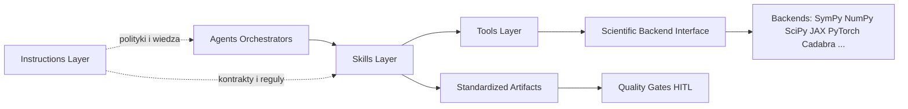

# Analiza architektury SAF/LTR: Agents-first vs architektura warstwowa

Data: 2026-07-01
Zakres: analiza na podstawie artefaktow repozytorium SAF/LTR, bez refaktoryzacji kodu.
Status: OK
Pewnosc: 0.87

## 0. Decyzja wobec hipotezy

Hipoteza: przejscie z podejscia agents-first do warstw:
- Instructions
- Skills
- Tools
- Scientific Backend
- Agents (orkiestracja)

Werdykt: TAK, zmiana jest uzasadniona, ale jako migracja ewolucyjna (hybrydowa), a nie rewolucyjna.

Uzasadnienie:
- Obecny stan ma cechy nadmiernej odpowiedzialnosci agentow i duplikacji polityk.
- Repo juz posiada zalazki warstwowego podejscia (narzedzia w tools, globalne reguly w instrukcjach, task runnery), wiec migracja ma niski koszt wejscia.
- Najwieksza korzysc: oddzielenie wiedzy domenowej i polityk runtime od person agentow, co zwiekszy testowalnosc i reuse.

Jednoczesnie obecna architektura ma przewage w jednym obszarze:
- Szybki onboarding do pojedynczego agenta (wszystko w jednym pliku: misja, zasady, wejscia/wyjscia, guardrails), co upraszcza start lokalny kosztem duplikacji globalnej.

---

## 1. Czy obecna architektura ma oznaki nadmiernej odpowiedzialnosci agentow?

Tak.

Dowody z repo:
- Agent Orkiestrator zawiera jednoczesnie routing, polityki gate, definicje statusow, matryce zaleznosci, runtime krytyczny, fallback i placeholder policy, czyli odpowiedzialnosci governance + policy engine + orchestration: [.github/agents/research-orkiestrator.agent.md](.github/agents/research-orkiestrator.agent.md#L14).
- Wielu agentow zawiera skopiowane polityki runtime (statusy, fail_closed, placeholder policy), co oznacza rozproszony engine zasad: [.github/agents/artifact-quality.agent.md](.github/agents/artifact-quality.agent.md#L45), [.github/agents/model-review.agent.md](.github/agents/model-review.agent.md#L55), [.github/agents/statistics-review.agent.md](.github/agents/statistics-review.agent.md#L74).
- Agenci mieszaja role eksperta domenowego z instrukcja operacyjna narzedzi i polityk raportowania, np. Cross-Reference laczy analize literatury z uruchamianiem konkretnych skryptow: [.github/agents/cross-reference.agent.md](.github/agents/cross-reference.agent.md#L18).
- Czesc decyzji o backendach narzedziowych jest opisana proceduralnie w profilach agentow zamiast jako kontrakty narzedziowe/skillowe: [.github/agents/simulation-experiment.agent.md](.github/agents/simulation-experiment.agent.md#L61), [.github/agents/statistics-review.agent.md](.github/agents/statistics-review.agent.md#L67).

Wniosek architektoniczny:
- Naruszenie SRP (Single Responsibility) na poziomie definicji agenta.
- Nizsza spojnosc (High Cohesion) i wyzsze sprzezenie (Low Coupling nie jest utrzymane) miedzy politykami a personami agentow.

---

## 2. Tabela duplikacji kompetencji miedzy agentami

| Kompetencja | Gdzie wystepuje (przyklady) | Skutek architektoniczny | Priorytet migracji |
|---|---|---|---|
| Statusy OK/Warning/Blocker + pewnosc 0-1 | praktycznie wszystkie profile agentow, np. [.github/agents/formal-consistency.agent.md](.github/agents/formal-consistency.agent.md#L39), [.github/agents/artifact-quality.agent.md](.github/agents/artifact-quality.agent.md#L63) | duplikacja logiki raportowania, ryzyko driftu semantyki | wysoki |
| Placeholder Policy v1 | niemal wszystkie profile agentow, np. [.github/agents/model-review.agent.md](.github/agents/model-review.agent.md#L59), [.github/agents/cross-reference.agent.md](.github/agents/cross-reference.agent.md#L62) | policy copy-paste, trudna ewolucja zasad | wysoki |
| Gate policy i fail_closed | orkiestrator + artifact-quality + globalne instrukcje: [.github/agents/research-orkiestrator.agent.md](.github/agents/research-orkiestrator.agent.md#L151), [.github/agents/artifact-quality.agent.md](.github/agents/artifact-quality.agent.md#L45), [.github/copilot-instructions.md](.github/copilot-instructions.md#L31) | rozproszone zrodla prawdy | wysoki |
| Walidacja notacji/LaTeX/jednostek | formal-consistency + model-review | nakladanie odpowiedzialnosci recenzenckich | sredni |
| Obsluga literatury | physics-discovery + cross-reference + globalne instrukcje ADS/ArXiv | overlap kompetencyjny i brak jednolitego kontraktu zapytan | sredni |
| Definicja narzedzi MVP | profile agentow + instrukcje globalne | mieszanie warstwy narzedziowej z warstwa roli | wysoki |
| Raportowanie Q-XXX | profile agentow + orkiestrator | duplikacja formatu i workflow pytan | sredni |

Ocena: duplikacja jest systemowa, nie incydentalna.

---

## 3. Proponowany katalog Skills

Cel: wyciagnac proceduralna ekspertyze z agentow do reuzywalnych modulow.

| Skill | Odpowiedzialnosc | Wejscie | Wyjscie | Zaleznosci | Reuse |
|---|---|---|---|---|---|
| Notation Consistency Skill | kontrola notacji, ID, EQ, jednostek | mapa notacji, raport wyprowadzen | tabela niespojnosci + lista [VERIFY-CAS] | [tools/lint_ltr.py](tools/lint_ltr.py), Formal rules instruction | wysoki |
| Mathematical Validation Skill | walidacja symboliczna i numeryczna krokow | rownania, config testow CAS | raport PASS/FAIL + lokalizacje | [tools/cas_test_harness.py](tools/cas_test_harness.py), SymPy backend | wysoki |
| Literature Search Skill | query pipeline ArXiv/ADS/CrossRef | slowa kluczowe, filtry, token | tabela zrodel + klasyfikacja | [tools/arxiv_search.py](tools/arxiv_search.py), [tools/ads_search.py](tools/ads_search.py) | wysoki |
| Physics Reasoning Skill | kontrola zalozen fizycznych i warunkow brzegowych | raport wyprowadzen, context pack | tabela niespojnosci merytorycznych | physics instructions | sredni |
| Data Quality Skill | kontrola jakosci i pochodzenia danych | plan danych, artefakty danych | tabela problemow + priorytety | [tools/parameter_provenance_check.py](tools/parameter_provenance_check.py) | wysoki |
| Uncertainty & CI Skill | CI, wrazliwosc, korekty wielokrotnosci | wyniki + zalozenia testow | tabela niepewnosci + status | stat methods instruction, optional NumPy/SciPy backend | wysoki |
| Risk Assessment Skill | klasyfikacja ryzyk i mitygacje | risk pack, wyniki walidacji | tabela ryzyk z ownerami | [tools/security_sanity_check.py](tools/security_sanity_check.py) | sredni |
| Report Generation Skill | standaryzacja raportow i podsumowan | wyniki skilli | artefakt markdown zgodny z szablonami | templates instructions | wysoki |
| Evidence Packaging Skill | pakietowanie sladu dowodowego pod gate | metadane gate + artefakty | evidence packet | [tools/build_evidence_packet.py](tools/build_evidence_packet.py) | wysoki |
| Process Suite Skill | uruchamianie i agregacja quality checks | config JSON | raport procesowy OK/Warning/Blocker | [tools/process_suite_runner.py](tools/process_suite_runner.py) | wysoki |

Mapowanie roli agenta po migracji:
- Agent = wybiera i sekwencjonuje Skills.
- Skill = realizuje ekspertyze i zwraca standaryzowany output.

---

## 4. Proponowany katalog Instructions

Cel: oddzielenie wiedzy i polityk od person agentow.

| Instruction file | Zakres wiedzy (pojedyncza odpowiedzialnosc) | Zrodlo obecne |
|---|---|---|
| physics.instructions.md | zasady oceny zalozen fizycznych, warunki brzegowe, prawa zachowania | model-review + dokumentacja systemowa |
| notation.instructions.md | notacja, ID map, EQ tagging, jednostki | formal-consistency + LTR |
| latex.instructions.md | zasady analizy i walidacji rownan LaTeX | formal/model review |
| literature.instructions.md | polityka wyszukiwania i klasyfikacji zrodel | physics-discovery + cross-reference |
| statistics.instructions.md | CI, wrazliwosc, test assumptions, multiple testing | statistics-review |
| risk.instructions.md | skale ryzyka, mitygacje, fail-closed trigger | risk-compliance + copilot instructions |
| quality-gates.instructions.md | gate policy, status semantics, HITL | [.github/copilot-instructions.md](.github/copilot-instructions.md#L31) |
| reporting.instructions.md | format statusow, confidence, Q-XXX, tabele | wiele agentow |
| publication.instructions.md | wymagania redakcyjne i zero-loss | language-polish-quality + process docs |
| coding.instructions.md | zasady patchowania i automatyzacji | technical-developer |
| tool-contracts.instructions.md | wspolne kontrakty wywolan narzedzi | obecnie rozproszone |

Zasada migracji:
- Agent profile pozostaje krotki (misja, routing, guardrails).
- Instructions przejmuje polityki i wiedze przekrojowa.

---

## 5. Proponowany katalog Tools i interfejsy

Cel: oddzielenie narzedzi wykonawczych od skilli i agentow.

### 5.1 Stan obecny (fakty)

Rzeczywiscie uzywany stack obliczeniowy i procesowy:
- SymPy: [tools/cas_test_harness.py](tools/cas_test_harness.py#L13)
- NumPy + Matplotlib: [tools/binet_numeric_validation_t04.py](tools/binet_numeric_validation_t04.py#L8), [tools/generate_t04_charts.py](tools/generate_t04_charts.py#L6)
- ArXiv/ADS: [tools/arxiv_search.py](tools/arxiv_search.py), [tools/ads_search.py](tools/ads_search.py)
- Governance tools: [tools/mcp_baseline.py](tools/mcp_baseline.py), [tools/taxonomy_guard.py](tools/taxonomy_guard.py), [tools/build_evidence_packet.py](tools/build_evidence_packet.py), [tools/process_suite_runner.py](tools/process_suite_runner.py)

Uwaga: SciPy/JAX/PyTorch/FEniCS/Cadabra/FORM/Mathematica/Maple nie sa aktualnie zintegrowane na poziomie kodu tools.

### 5.2 Katalog narzedzi po migracji (kontrakty)

| Tool contract | Input contract | Output contract | Error contract |
|---|---|---|---|
| Tool.LintLTR | artifact_paths[], mode | findings[] (ID, severity, location, message) | code + diagnostics |
| Tool.CASValidate | equations[], tests_config | cas_results[] + summary | blocker_reason |
| Tool.LiteratureSearch | query, sources[], filters | citations[] (source, type, confidence, url) | source_unavailable |
| Tool.ProvenanceCheck | data_artifacts[] | provenance_findings[] | missing_metadata |
| Tool.EvidencePacket | gate_id, owner, decision, artifacts[] | packet_path + manifest | invalid_manifest |
| Tool.ProcessSuite | config_path | status_report + per_check_result[] | check_failed |
| Tool.ModelRouting | agent, gate, risk | model_name | invalid_rule |
| Tool.ChartPipeline | dataset + chart_specs | chart_artifacts[] + index | chart_missing |

Zasada:
- Skills korzystaja z Tool contracts.
- Agenci nie odwoluja sie do implementacji narzedzia bezposrednio w polityce roli.

---

## 6. Scientific Backend Interface (analiza, bez implementacji)

### 6.1 Wymagania

- Niezaleznosc od agenta: backend ma byc wywolywany przez Skill/Tool layer.
- Determinizm i audytowalnosc: jawna wersja, seed, parametry, metadane.
- Standaryzowany wynik: PASS/FAIL + diagnostics + confidence support.
- Tryby obliczen: symboliczne, numeryczne, statystyczne.
- Obsluga fallback i fail_closed przy braku backendu.

### 6.2 Odpowiedzialnosci warstwy backend

- Realizacja operacji obliczeniowych (nie polityk gate i nie orchestracji).
- Normalizacja wynikow do wspolnego formatu.
- Raportowanie ograniczen backendu (stabilnosc, zbieznosc, precision).

### 6.3 Proponowany kontrakt (logiczny)

Interface: ScientificBackend
- capability_check(task_type) -> supported/not_supported + reason
- execute(task_spec, context) -> result_payload + diagnostics + metadata
- validate(result_payload, validation_spec) -> validation_report
- export_trace(result_payload) -> audit_artifacts

Obowiazkowe metadane:
- backend_name
- backend_version
- execution_mode
- deterministic_seed (jesli dotyczy)
- input_hash
- runtime_limits

### 6.4 Potencjalne backendy

- Obecnie gotowe: SymPy, NumPy (przez tools).
- Kandydaci do integracji: SciPy, Cadabra, FORM, Mathematica, Maple, FEniCS, JAX, PyTorch.

Wniosek:
- Backend interface jest wykonalny i zgodny z obecnym repo, bo tools juz izoluja spora czesc wykonania od definicji agentow.

---

## 7. Wplyw na GitHub Copilot

Ocena: nowa architektura jest bardziej zgodna z kierunkiem Copilot (custom instructions, prompt files, skills, MCP, context management).

Uzasadnienie:
- Copilot preferuje modularny kontekst: mniejsze, wyspecjalizowane instrukcje i skille latwiej doladowac niz duze profile agentow.
- Skills sa naturalnym punktem reuse w trybach i promptach.
- MCP/tool contracts poprawiaja przewidywalnosc i ograniczaja prompt drift.
- Context management zyskuje na rozdzieleniu: agent prompt moze byc krotszy, a wiedza domenowa zostaje w instructions.

Dowody na obecny kierunek kompatybilny z takim ruchem:
- Istnieja prompt files i instrukcje globalne: [.github/copilot-instructions.md](.github/copilot-instructions.md), [.github/prompts/konsolidacja-statusow.prompt.md](.github/prompts/konsolidacja-statusow.prompt.md).
- Istnieja autonomiczne tools z CLI i JSON config: [tools/process_suite_runner.py](tools/process_suite_runner.py), [tools/route_model.py](tools/route_model.py).

Ryzyko:
- Nadmierna fragmentacja instructions moze zwiekszyc koszt utrzymania bez dobrego governance wersji.

---

## 8. Wplyw na utrzymanie projektu: obecna vs nowa architektura

| Kryterium | Obecna (agents-first) | Docelowa (layered) | Ocena |
|---|---|---|---|
| Skalowalnosc | dobra dla malej liczby rol; spada przy rozbudowie polityk | wysoka, bo wiedza i polityki sa wspoldzielone | przewaga layered |
| Testowalnosc | ograniczona (duzo logiki opisowej w profilach) | wyzsza (skills/tool contracts testowalne osobno) | przewaga layered |
| Wymiana backendow | trudna, bo backend hints rozsiane po agentach | prostsza przez Scientific Backend Interface | przewaga layered |
| Reuse komponentow | sredni, duplikacja policy blocks | wysoki, jednolite instructions/skills | przewaga layered |
| Onboarding contributorow | szybki start per agent, ale trudny obraz calosci | lepsza mapa odpowiedzialnosci po wdrozeniu | mieszane |
| Czytelnosc | dobra lokalnie, gorsza globalnie (powtorzenia) | lepsza globalnie, wymaga porzadku w katalogach | przewaga layered |

Obszar, gdzie obecna architektura jest lepsza:
- Lokalna samowystarczalnosc pojedynczego pliku agenta.

---

## 9. Analiza ryzyk migracji

| Ryzyko | Prawdopodobienstwo | Wplyw | Mitigacja |
|---|---|---|---|
| Rozjechanie semantyki statusow po rozbiciu instrukcji | srednie | wysokie | jedno zrodlo prawdy: quality-gates.instructions.md + regression checks |
| Przeciaganie migracji i brak domkniecia | srednie | srednie | migracja etapowa z Definition of Done per etap |
| Spadek produktywnosci przez nadmierna modularnosc | srednie | srednie | limit minimalnej granularnosci skilli, przeglad architektury co etap |
| Niezgodnosc promptow z nowymi skillami | wysokie | srednie | plan update prompt files + testy smoke promptow |
| Brak kompatybilnosci wstecznej artefaktow case'ow | niskie | wysokie | adapter outputs i tryb dual-run w okresie przejsciowym |
| Niedoszacowanie kosztu governance wersji instructions | srednie | srednie | versioning instrukcji + changelog + ownerzy obszarow |

Status ryzyka globalny: Warning
Pewnosc: 0.82

---

## 10. Roadmapa migracji (bez zmian kodu, plan)

### Etap 0: Baseline i inwentaryzacja
- Cel: zamrozic stan i zidentyfikowac source of truth.
- Zakres: mapa duplikacji, mapa zaleznosci agent->tool, lista polityk globalnych.
- Artefakty: inventory.md, duplication-matrix.md.
- Zaleznosci: brak.
- Ryzyka: niepelny inventory.
- Kryterium zakonczenia: 100% agentow i tools pokryte mapa.

### Etap 1: Ekstrakcja Instructions
- Cel: przeniesc polityki przekrojowe z agentow do dedykowanych instrukcji.
- Zakres: quality gates, reporting, placeholder policy, runtime krytyczny.
- Artefakty: quality-gates.instructions.md, reporting.instructions.md, tool-contracts.instructions.md.
- Zaleznosci: Etap 0.
- Ryzyka: semantyczny drift.
- Kryterium zakonczenia: brak duplikacji polityk w profilach agentow (poza referencja).

### Etap 2: Wydzielenie Skills
- Cel: zamknac proceduralna ekspertyze w skillach.
- Zakres: Notation, Math Validation, Literature, Data Quality, Uncertainty, Evidence Packaging.
- Artefakty: katalog skills + kontrakty input/output.
- Zaleznosci: Etap 1.
- Ryzyka: zla granularnosc skilli.
- Kryterium zakonczenia: min. 80% zadan agentow wykonywalne jako skill chain.

### Etap 3: Kontrakty Tools
- Cel: ustalic jednolity interfejs narzedzi.
- Zakres: normalizacja I/O i kodow bledow dla kluczowych narzedzi.
- Artefakty: tool-contracts registry + compatibility matrix.
- Zaleznosci: Etap 2.
- Ryzyka: koszt adapterow.
- Kryterium zakonczenia: wszystkie kluczowe narzedzia mapuja do wspolnego schematu wynikow.

### Etap 4: Scientific Backend Interface (warstwa logiczna)
- Cel: odseparowac backend obliczeniowy od agentow.
- Zakres: definicja kontraktu capability/execute/validate/export_trace.
- Artefakty: backend-interface-spec.md, backend-capabilities.md.
- Zaleznosci: Etap 3.
- Ryzyka: nadmierna abstrakcja.
- Kryterium zakonczenia: co najmniej 2 backendy opisane i mapowalne (np. SymPy + NumPy).

### Etap 5: Przebudowa roli agentow do orchestrator-only
- Cel: odchudzenie plikow agentow.
- Zakres: agent = routing + ownership + eskalacja + guardrails.
- Artefakty: nowe profile agentow v2.
- Zaleznosci: Etapy 1-4.
- Ryzyka: regresja behavioru promptow.
- Kryterium zakonczenia: profile agentow <= 35% obecnej objetosci, bez utraty funkcji.

### Etap 6: Migracja promptow i walidacja koncowa
- Cel: domknac kompatybilnosc z workflow Copilot.
- Zakres: aktualizacja prompt files, testy quality-gates-plus-p0, testy case T04.
- Artefakty: migration-report.md, compatibility-report.md.
- Zaleznosci: Etap 5.
- Ryzyka: niezgodnosc kontekstowa.
- Kryterium zakonczenia: brak blockerow w suite oraz zatwierdzenie HITL.

---

## Macierz odpowiedzialnosci (Agents vs Skills vs Tools vs Instructions)

| Obszar | Agent (docelowo) | Skill | Tool | Instruction |
|---|---|---|---|---|
| Notacja i formalna spojnosc | Formal Consistency Orchestrator | Notation Consistency Skill | Tool.LintLTR, Tool.CASValidate | notation.instructions.md, latex.instructions.md |
| Poprawnosc fizyczna modelu | Model Review Orchestrator | Physics Reasoning Skill | Tool.CASValidate (+ backend symbolic/numeric) | physics.instructions.md |
| Literatura | Discovery/CrossRef Orchestrator | Literature Search Skill | Tool.LiteratureSearch | literature.instructions.md |
| Jakosc danych | Data Quality Orchestrator | Data Quality Skill | Tool.ProvenanceCheck | data-quality.instructions.md |
| Statystyka i CI | Statistics Orchestrator | Uncertainty & CI Skill | Tool.ProcessSuite (dla checkow), backend stat | statistics.instructions.md |
| Ryzyka | Risk Orchestrator | Risk Assessment Skill | Tool.SecuritySanity | risk.instructions.md |
| Konsolidacja i gate | Artifact Quality Orchestrator | Evidence Packaging Skill + Report Generation Skill | Tool.EvidencePacket | quality-gates.instructions.md, reporting.instructions.md |
| Operacje techniczne | Technical Developer Orchestrator | Process Suite Skill | Tool.ProcessSuite, Tool.ModelRouting | coding.instructions.md, tool-contracts.instructions.md |

---

## Proponowana architektura docelowa

Zasady:
- Agents: routing, ownership konfliktu, eskalacja.
- Skills: logika merytoryczna i proceduralna.
- Tools: wykonanie operacyjne i standaryzacja outputu.
- Scientific Backend: czysta warstwa obliczeniowa bez zaleznosci od agentow.
- Instructions: jedyne zrodlo polityk i wiedzy przekrojowej.

---

## 11. Ocena wplywu na workflow i zaleznosci miedzy agentami (opinia)

### 11.1 Wplyw na workflow end-to-end

Ocena: pozytywny netto (Warning -> OK warunkowe po domknieciu migracji Etap 2-3).

Wplyw na przebieg procesu:
- Kickoff i Gate 1: krotszy czas uzgodnienia zasad, bo polityki i formaty raportowania beda pobierane z jednej warstwy Instructions zamiast z wielu profili agentow.
- Gate 2-3 (najbardziej zlozone): mniejsze ryzyko niespojnosci miedzy raportami, bo Skills beda generowac standaryzowane artefakty niezaleznie od persony agenta.
- Gate 4 i auditability: wyzsza powtarzalnosc dowodowa przez wspolne kontrakty Tool i spojnosc metadata outputow.

Wplyw na przeplyw decyzji:
- Obecnie czesc logiki decyzyjnej jest replikowana w agentach; po migracji decyzje runtime opieraja sie o jedna polityke gate.
- Zmniejsza to ryzyko "rozjazdu interpretacyjnego" miedzy agentami przy tych samych danych wejsciowych.

### 11.2 Wplyw na zaleznosci miedzy agentami

Zmiana struktury zaleznosci:
- Przed: Agent A -> Agent B + lokalna polityka A/B.
- Po: Agent A -> Skill X -> Tool Y -> (opcjonalnie backend) oraz Agent B korzysta z tych samych kontraktow.

Efekt:
- Mniej zaleznosci ukrytych (implicit) i mniej twardych zaleznosci person-to-person.
- Wiecej zaleznosci jawnych i testowalnych na poziomie skill/tool contract.

Porownanie krytycznych lancuchow:
- Formal Consistency -> Model Review: po migracji konflikt notacji i konflikt fizyczny pozostaja rozdzielone, ale korzystaja z tej samej warstwy instrukcji notacyjnej; ryzyko sporow kompetencyjnych spada.
- Data Quality -> Statistics Review: jakosc danych staje sie twardym wejsciem do skillu niepewnosci; poprawia to dyscypline wejsc i zmniejsza liczbe "warunkowych" analiz statystycznych.
- Discovery -> Cross-Reference -> Model Review: literatura i interpretacja beda rozlaczone funkcjonalnie, ale spinane kontraktem artefaktu (claims->sources->implications).
- Language Polish Quality -> Artifact Quality: utrzymana obowiazkowosc walidacji jezykowej przed finalizacja, z mniejszym ryzykiem naruszenia ID/EQ dzieki centralnym reguom.

### 11.3 Ryzyka workflow specyficzne dla migracji

Najbardziej prawdopodobne skutki uboczne:
- Przejsciowe wydluzenie cyklu gate przez dual-run (stary i nowy sposob raportowania).
- Wzrost liczby artefaktow konfiguracyjnych (instructions/skills contracts), co moze czasowo obciazyc Orkiestratora.
- Ryzyko "nadmiernej orkiestracji" gdy agent bedzie zbyt czesto przechodzil przez drobne skille zamiast laczyc je w sensowne pakiety.

Mitigacje operacyjne:
- Utrzymac twarda kolejnosc: najpierw Instructions, potem Skills, potem Tools contracts.
- Wprowadzic limit minimalnej granularnosci: jeden skill powinien domykac cala mikro-funkcje, nie pojedynczy krok mechaniczny.
- Przez 1-2 iteracje gate uruchamiac kontrole porownawcze outputow (old vs layered) dla tych samych wejsc.

### 11.4 Opinia autora (jednoznaczna)

Moja opinia: propozycja poprawi caly workflow SAF/LTR i uproscie zaleznosci miedzy agentami, pod warunkiem konsekwentnej migracji governance-first.

Dlaczego:
- Najwiekszy obecny koszt to nie brak narzedzi, tylko rozproszenie polityk i duplikacja logiki w profilach agentow.
- Warstwowanie zmniejsza coupling miedzy agentami i przenosi stabilnosc procesu do kontraktow, ktore da sie testowac.
- Model orkiestrator-only jest zgodny z tym, jak repo i tak juz pracuje operacyjnie (task runner, evidence packet, route model, quality gates).

Warunek krytyczny:
- Nie wolno oslabic fail_closed, HITL oraz ownership konfliktow podczas uproszczenia profili agentow.

Ocena koncowa tej zmiany dla workflow:
- status: Warning (w trakcie migracji), docelowo OK.
- pewnosc: 0.84.

---

## 12. Sprawdzenie spojnosci terminologicznej nowego podzialu (opinia)

Zakres sprawdzenia:
- porownanie terminow z tego dokumentu z terminologia bazowa repo (agent profiles, instrukcje globalne, dokumentacja systemowa),
- ocena, czy nowy podzial (Instructions/Skills/Tools/Scientific Backend/Agents) nie wprowadza kolizji semantycznych.

Wynik:
- status: Warning.
- pewnosc: 0.86.
- ocena ogolna: podzial jest zasadniczo spojny, ale zawiera kilka niespojnosci nazewniczych, ktore moga utrudnic wdrozenie i audyt.

### 12.1 Wykryte niespojnosci

| ID | Obszar | Obserwacja | Wplyw | Rekomendacja |
|---|---|---|---|---|
| TERM-001 | Poziomy decyzji | Mieszanie jezykow statusowych: OK/Warning/Blocker (status roboczy) i pass/pass-with-comments/fail (decyzja gate) bez jawnej tabeli mapowania w tym dokumencie. | ryzyko mylnej interpretacji wyniku workflow | Dodac jawna mape: status roboczy != decyzja gate, z relacja i warunkami przejscia. |
| TERM-002 | Nazwy rol docelowych | W macierzy wystepuja nazwy typu Statistics Orchestrator, Risk Orchestrator, Discovery/CrossRef Orchestrator, ktore nie sa 1:1 z aktualnymi identyfikatorami agentow w repo. | trudniejsza sledzalnosc agent->owner->artefakt | Dodac mapowanie aliasow docelowych do nazw kanonicznych (np. statistics-review, risk-compliance, physics-discovery, cross-reference). |
| TERM-003 | Katalog Tool contracts | W macierzy pojawia sie Tool.SecuritySanity, ale taki kontrakt nie jest zdefiniowany w tabeli kontraktow (jest tylko odniesienie do security_sanity_check.py). | niespojnosc specyfikacji kontraktow narzedzi | Ujednolicic do jednej nazwy, np. Tool.SecuritySanityCheck, i dopisac ten kontrakt do tabeli 5.2. |
| TERM-004 | Nazewnictwo warstw | Rownolegle uzyte sa formy tool contract, tool contracts, Tools contracts oraz orchestrator-only. | drobny drift slownikowy, gorsza czytelnosc | Przyjac jeden slownik: kontrakt narzedzia/kontrakty narzedzi oraz model orkiestrator-only (z definicja). |
| TERM-005 | Termin backendowy | Zwrot backend stat w macierzy jest skrotem nieokreslonym i odbiega od formalnej nazwy Scientific Backend Interface. | niejednoznacznosc przy implementacji i testach | Zastapic backend stat przez backend statystyczny (Scientific Backend Interface: stat capability). |

### 12.2 Elementy terminologicznie spojne

- Spojne i poprawnie utrzymane: Gate 1/2/4 (HITL), Gate 3 (agent-conditional pass), fail_closed, Q-XXX, DO_UZUPELNIENIA.
- Spojna jest tez os nowego podzialu: Instructions -> Skills -> Tools -> Scientific Backend -> Agents (orkiestracja).

### 12.3 Opinia autora

Moja opinia: nowy podzial nie wprowadza krytycznych sprzecznosci terminologicznych, ale obecnie jest na poziomie Warning przez 5 niespojnosci nazewniczych (glownie aliasy ról i jeden brakujacy kontrakt narzedzia).

Po domknieciu rekomendacji TERM-001..TERM-005 dokument bedzie terminologicznie gotowy do migracji etapowej bez istotnego ryzyka interpretacyjnego.

---

## 13. Analiza ryzyk migracji i zgodnosci z zasada fail-closed (opinia)

Podstawa oceny:
- zasady runtime krytycznego i fail-closed z [.github/copilot-instructions.md](.github/copilot-instructions.md#L27),
- reguly orkiestratora z [.github/agents/research-orkiestrator.agent.md](.github/agents/research-orkiestrator.agent.md#L151),
- propozycja migracji i architektury warstwowej opisana w tym dokumencie.

Wynik laczny:
- status: Warning.
- pewnosc: 0.88.
- werdykt: propozycja jest zgodna kierunkowo z fail-closed, ale wymaga twardych kontroli implementacyjnych w etapach 1-4, aby uniknac oslabienia zasad runtime krytycznego.

### 13.1 Kontrola zgodnosci fail-closed (checklist)

| ID | Kryterium fail-closed | Ocena | Uzasadnienie |
|---|---|---|---|
| FC-001 | Gate 1/2/4 tylko HITL | OK | Dokument utrzymuje zasade niezmiennej akceptacji ludzkiej i nie proponuje automatyzacji decyzji gate 1/2/4. |
| FC-002 | Gate 3 tylko warunkowo (niskie ryzyko + status OK bez krytycznych uwag) | OK | Zasada agent-conditional pass pozostaje zachowana jako wyjatek kontrolowany. |
| FC-003 | Status roboczy != decyzja gate | Warning | Wystepuje ryzyko mylenia poziomow statusow (TERM-001), brak jawnej mapy przejsc status->decyzja. |
| FC-004 | Brak danych krytycznych => Blocker + eskalacja | OK warunkowe | Kierunek jest poprawny, ale wymaga formalnego kontraktu wejsc dla skilli i narzedzi (Etap 2-3), inaczej czesc brakow moze byc oceniona zbyt pozno. |
| FC-005 | Placeholder zakazany w runtime krytycznym | OK warunkowe | Zasada jest przyjeta, ale po ekstrakcji do Instructions musi byc centralnie egzekwowana i testowana regresyjnie. |
| FC-006 | Ownership konfliktu (notacja/fizyka/dane) jest jednoznaczny | OK | Propozycja utrzymuje obecny ownership i dodatkowo porzadkuje go warstwowo. |
| FC-007 | Kazdy Blocker zatrzymuje przeplyw i eskaluje | Warning | Warunek obecny koncepcyjnie, ale brak jeszcze jawnego "kill switch" w kontraktach Tool/Skill (brak standardu obligatoryjnego exit behavior dla Blocker). |

### 13.2 Ryzyka migracji specyficzne dla fail-closed

| ID | Ryzyko | Prawdopodobienstwo | Wplyw | Mitigacja |
|---|---|---|---|---|
| FC-R01 | Rozszczelnienie zasad przez rozproszenie instrukcji po migracji Etap 1 | srednie | wysokie | Jedno zrodlo prawdy: quality-gates.instructions.md + runtime-krytyczny.instructions.md + testy regresyjne polityk. |
| FC-R02 | Niespojne mapowanie status roboczy -> decyzja gate | wysokie | wysokie | Dodac jawna tabele mapowania i reguly blokujace; walidowac w review-jakosci-gate. |
| FC-R03 | Brak twardego kontraktu Blocker w Tool contracts | srednie | wysokie | Rozszerzyc kontrakty o pole mandatory: stop_flow=true dla klasy Blocker + wymagane escalation_target. |
| FC-R04 | Opoznione wykrycie brakow krytycznych przy przejsciu na skill chain | srednie | srednie | Wymusic precondition checks na wejsciu kazdego skillu i fail-fast przy brakach krytycznych. |
| FC-R05 | Niewlasciwe obchodzenie placeholderow po rozbiciu na warstwy | srednie | srednie | Walidator placeholderow (owner, ttl, fail_closed) jako obowiazkowy krok quality-gates-plus-p0. |

### 13.3 Warunki brzegowe akceptacji migracji (fail-closed gates)

Migracja moze byc uznana za zgodna z fail-closed tylko jesli spelnione sa wszystkie warunki:
1. Zdefiniowana i opublikowana mapa: status roboczy -> decyzja gate z przypadkami Blocker.
2. Tool contracts zawieraja jawny semafor zatrzymania przeplywu dla Blocker.
3. Skill contracts wymuszaja fail-fast na brakach danych krytycznych.
4. Placeholder policy jest centralna i automatycznie walidowana (owner/ttl/fail_closed).
5. Test suite migracyjny sprawdza co najmniej scenariusze: brak danych krytycznych, konflikt ownership, Blocker w dowolnym etapie.

### 13.4 Opinia autora

Moja opinia: architektura warstwowa jest zgodna z filozofia fail-closed SAF/LTR, ale tylko przy rygorystycznym wdrozeniu mechanizmow zatrzymania przeplywu i eskalacji na poziomie kontraktow Skills/Tools.

Interpretacja praktyczna:
- obecnie: Warning (ryzyko implementacyjne),
- docelowo: OK po domknieciu FC-001..FC-007 oraz FC-R01..FC-R05.

Rekomendacja operacyjna:
- Traktowac fail-closed jako "non-negotiable invariant" migracji: kazde odchylenie od warunkow 13.3 = Blocker i natychmiastowa eskalacja do Orkiestratora oraz czlowieka.

---

## 14. Uzupelnienie strategiczne: Framework vs Scientific Operating System

Zakres tej sekcji:
- odpowiada na hipoteze o naturze projektu,
- rozszerza analize o perspektywe platformowa,
- nie powiela wnioskow o samym podziale Agents/Skills/Tools.

### 14.1 Tozsamosc architektury (stan obecny)

Werdykt:
- SAF/LTR nie jest juz wyłącznie frameworkiem agentowym.
- Obecnie jest hybryda: system workflow + governance engine + warstwa uslug naukowych, w ktorej agenci sa jedna z form wykonania.
- Najblizsza etykieta strategiczna: Scientific Research Platform (Operating System for Research), ale jeszcze w fazie przejsciowej.

Uzasadnienie repo-driven:
- Decyzje i przebieg pracy sa organizowane wokol artefaktow i gate, nie wokol pojedynczych agentow: [Dokumentacja/Runbook-Gate-Executor.md](Dokumentacja/Runbook-Gate-Executor.md), [Dokumentacja/Dokumentacja-Systemowa.md](Dokumentacja/Dokumentacja-Systemowa.md#L88).
- Istnieja niezalezne uslugi procesowe uruchamiane poza personami agentow: [tools/process_suite_runner.py](tools/process_suite_runner.py), [tools/build_evidence_packet.py](tools/build_evidence_packet.py), [tools/mcp_baseline.py](tools/mcp_baseline.py).
- Struktura case lifecycle jest stabilna i powtarzalna miedzy badaniami, co jest cecha platformy, nie tylko frameworka promptowego: [Badania/T04-GR-PPN-Yukawa-Perihelion/Process-Suite-T04.json](Badania/T04-GR-PPN-Yukawa-Perihelion/Process-Suite-T04.json), [Dokumentacja/Szablon-Fizyka/Checklista-Research-Gate.md](Dokumentacja/Szablon-Fizyka/Checklista-Research-Gate.md).

Ocena hipotezy Framework vs Scientific OS:
- status: OK (hipoteza potwierdzona warunkowo).
- pewnosc: 0.85.

### 14.2 Trwale elementy architektury (rdzen niezalezny od technologii)

Elementy fundamentalne (powinny pozostac niezmienne niezaleznie od LLM, vendor AI i backendow):
1. Workflow i sekwencja gate.
2. Human-in-the-Loop dla decyzji krytycznych.
3. Fail-closed i eskalacja przy Blocker.
4. Traceability (ID/EQ/Q-XXX, slady decyzji).
5. Governance konfliktow (ownership notacja/fizyka/dane).
6. Evidence management i lifecycle artefaktow.

Elementy implementacyjne (mogace sie zmieniac):
1. Konkretni agenci i ich profile.
2. Model routing i vendor modelu.
3. Konkretne narzedzia i backendy obliczeniowe.
4. Forma opakowania prompt/skill.

Wniosek:
- Rdzen SAF/LTR jest procesowo-governance'owy, nie modelowy.

### 14.3 Warstwy platformy: korekta modelu

Model Instructions -> Skills -> Tools -> Scientific Backend -> Agents jest krokiem naprzod, ale nie domyka perspektywy platformowej.

Model rekomendowany (docelowy):
1. Governance Layer: zasady gate, fail-closed, ownership konfliktow, compliance.
2. Workflow Layer: orkiestracja lifecycle case, przejscia gate, SLA artefaktow.
3. Capability Layer: zdolnosci naukowe i procesowe (co platforma umie biznesowo).
4. Skill Layer: operacje reuzywalne (jak platforma to wykonuje).
5. Tooling Layer: narzedzia CLI/API i pipeline.
6. Scientific Platform Services: uslugi obliczeniowe, literaturowe, publikacyjne, wizualizacyjne, knowledge.
7. Execution Layer: agenci, automaty, czlowiek (HITL) jako wykonawcy krokow workflow.

Dlaczego tak:
- rozdziela "co" (capability) od "jak" (skill/tool),
- czyni workflow centralnym bytem sterujacym,
- pozwala traktowac agenta jako plug-in execution mode, a nie centrum systemu.

### 14.4 Capability vs Skill (weryfikacja)

Ocena: nie wszystkie pozycje nazwane wczesniej jako Skills sa faktycznie skillami; czesc to capabilities.

Przykladowa dekompozycja:

| Capability | Skills (operacyjne) |
|---|---|
| Physics Reasoning | dimensional-analysis, conservation-check, boundary-condition-check |
| Formal Consistency | id-eq-lint, notation-map-check, assumption-chain-check |
| Literature Intelligence | query-build, source-classification, claim-source-linking |
| Evidence Governance | packet-build, metadata-validate, traceability-join |
| Risk & Compliance | risk-score, mitigation-plan-check, escalation-trigger |

Efekt architektoniczny:
- Capability stabilizuje jezyk biznesowy platformy.
- Skill stabilizuje implementacje i testowalnosc.
- Zmniejsza to ryzyko przebudowy rdzenia przy dodawaniu nowych operacji.

### 14.5 Workflow jako centrum architektury

Weryfikacja hipotezy:
- Tak, realnym centrum SAF/LTR jest workflow, nie agent.

Model referencyjny:
Workflow -> Capability -> Skill -> Tool -> Platform Service/Backend -> Agent (executor)

Zalety:
1. Spojnosc decyzji i artefaktow niezaleznie od wykonawcy.
2. Lepsza audytowalnosc i kontrola ryzyka na poziomie procesu.
3. Latwiejsza zamiana agenta/modelu bez zmiany rdzenia.

Wady/koszty:
1. Wyzszy narzut projektowania kontraktow warstw.
2. Potrzeba silnego governance wersji workflow i capability catalog.
3. Ryzyko "process overfit" jesli workflow stanie sie zbyt sztywny.

### 14.6 Scientific Platform zamiast waskiego Scientific Backend

Ocena: szersze pojecie Scientific Platform lepiej odzwierciedla architekture SAF/LTR niz sam Scientific Backend.

Proponowane domeny uslug platformy:
1. Computational Services: CAS, obliczenia numeryczne, walidacja.
2. Literature Services: ArXiv/ADS/CrossRef, mapowanie claim->source.
3. Publication Services: split manuskrypt/suplement, walidacja redakcyjna, pakiet recenzencki.
4. Visualization Services: pipeline wykresow i kontrola artefaktow.
5. Knowledge Services: normalizacja taksonomii, reuse artefaktow.
6. Collaboration Services: delegacje, statusy, eskalacje, dziennik decyzji.

Mapowanie do repo (dowody):
- computational: [tools/cas_test_harness.py](tools/cas_test_harness.py), [tools/binet_numeric_validation_t04.py](tools/binet_numeric_validation_t04.py)
- literature: [tools/arxiv_search.py](tools/arxiv_search.py), [tools/ads_search.py](tools/ads_search.py)
- publication: [tools/manuscript_supplement_splitter.py](tools/manuscript_supplement_splitter.py), [tools/manuscript_completeness_check.py](tools/manuscript_completeness_check.py)
- visualization: [tools/generate_t04_charts.py](tools/generate_t04_charts.py), [tools/chart_artifact_pipeline_check.py](tools/chart_artifact_pipeline_check.py)
- knowledge: [tools/taxonomy_guard.py](tools/taxonomy_guard.py)
- collaboration/governance: [Dokumentacja/Konsolidacja-Statusow.md](Dokumentacja/Konsolidacja-Statusow.md), [Dokumentacja/Rejestr-Konfliktow-i-Eskalacji.md](Dokumentacja/Rejestr-Konfliktow-i-Eskalacji.md)

### 14.7 Architektura dlugoterminowa (3-5 lat)

Wizja docelowa:
- SAF/LTR jako rozszerzalna platforma badawcza z niezmiennym governance core i wymiennymi execution adapters.

Kierunki strategiczne:
1. Niezaleznosc od konkretnego LLM przez kontrakty capability/skill oraz workflow DSL.
2. Wymiennosc backendow przez service adapters i capability registry.
3. Skalowalnosc przez plugin model (nowe capability/skills bez przebudowy rdzenia).
4. Integracja narzedzi naukowych przez warstwe uslug platformowych.
5. Evidence-by-design: kazda operacja produkuje artefakt audytowy zgodny z governance.

Ryzyko strategiczne:
- najwieksze ryzyko to nie lock-in modelowy, tylko governance drift przy szybkim wzroscie liczby capability.

### 14.8 SAF/LTR Architecture Vision 2.0 (struktura dokumentu)

Proponowana struktura:
1. Mission Statement
2. Architectural Principles
3. Core Invariants (HITL, fail-closed, traceability, governance)
4. Layered Platform Model (Governance/Workflow/Capability/Skill/Tool/Services/Execution)
5. Layer Responsibilities
6. Inter-layer Contracts
7. Extensibility Model (plugins, adapters, capability registry)
8. Risk Model and Safety Constraints
9. Evolution Roadmap (3-5 years)
10. Conformance Criteria (co oznacza zgodnosc architektury z Vision 2.0)

Glowne tezy dokumentu Vision 2.0:
- Agent nie jest rdzeniem architektury; rdzeniem jest workflow-governance core.
- Capability jest jednostka strategiczna rozwoju platformy; skill jest jednostka operacyjna.
- Scientific Platform Services rozszerza pojęcie backendu i lepiej mapuje realny zakres SAF/LTR.
- Fail-closed i HITL sa niezmiennymi invariantami architektonicznymi, niezaleznymi od technologii wykonania.

Opinia koncowa dla uzupelnienia strategicznego:
- status: OK warunkowe.
- pewnosc: 0.86.
- warunek: formalizacja warstw Governance/Workflow/Capability jako osobnych kontraktow architektonicznych przed dalsza ekspansja narzedziowa.

---

## Quick Wins (0-4 tygodnie)

1. Wydzielenie quality-gates.instructions.md i usuniecie duplikacji gate policy z profili agentow.
2. Wydzielenie reporting.instructions.md (status, confidence, Q-XXX) i referencje z agentow.
3. Standaryzacja formatu outputu narzedzi processowych do jednego schematu.
4. Pilot 2-3 skilli o najwyzszym reuse: Notation, Literature, Evidence Packaging.
5. Dodanie mapy Agent->Skill->Tool do dokumentacji systemowej.

---

## Zmiany wymagajace decyzji wlasciciela projektu

1. Docelowa granularnosc skilli: minimalna liczba i granice odpowiedzialnosci.
2. Priorytet backendow obliczeniowych do integracji (poza SymPy/NumPy).
3. Poziom kompatybilnosci wstecznej dla istniejacych case artefaktow (strict vs adapter).
4. Wersjonowanie Instructions i ownership zmian (kto zatwierdza policy changes).
5. Kryterium przejscia na model orchestrator-only dla agentow (np. max rozmiar pliku agenta).

---

## Ocena koncowa

Rekomendacja: realizowac migracje warstwowa etapowo.

Powod:
- Spelnia SRP i Separation of Concerns.
- Podnosi Cohesion i obniza Coupling.
- Poprawia testowalnosc, reuse i gotowosc pod wielobackendowe obliczenia.
- Jest zgodna z trajektoria narzedziowa Copilot (instructions + prompts + skills + MCP/tooling).

Warunek powodzenia:
- migracja governance-first (najpierw instrukcje i kontrakty), nie code-first.
- utrzymanie fail_closed i HITL jako niezmiennych zasad runtime krytycznego.
