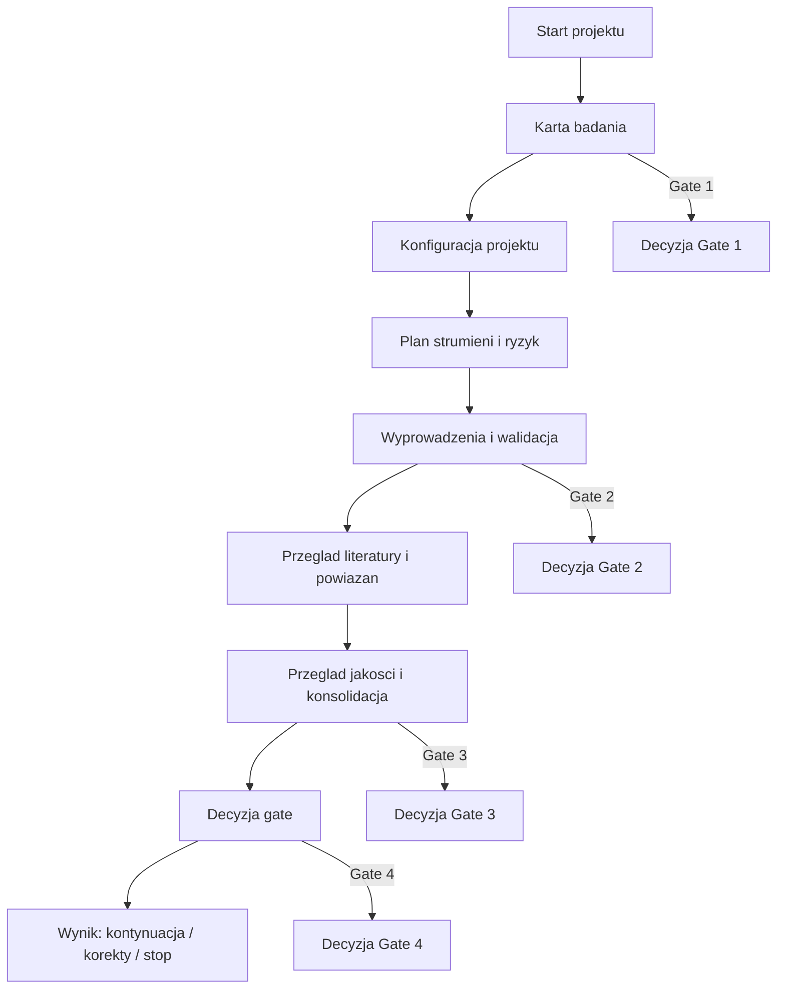
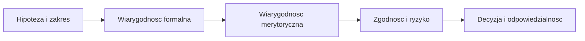
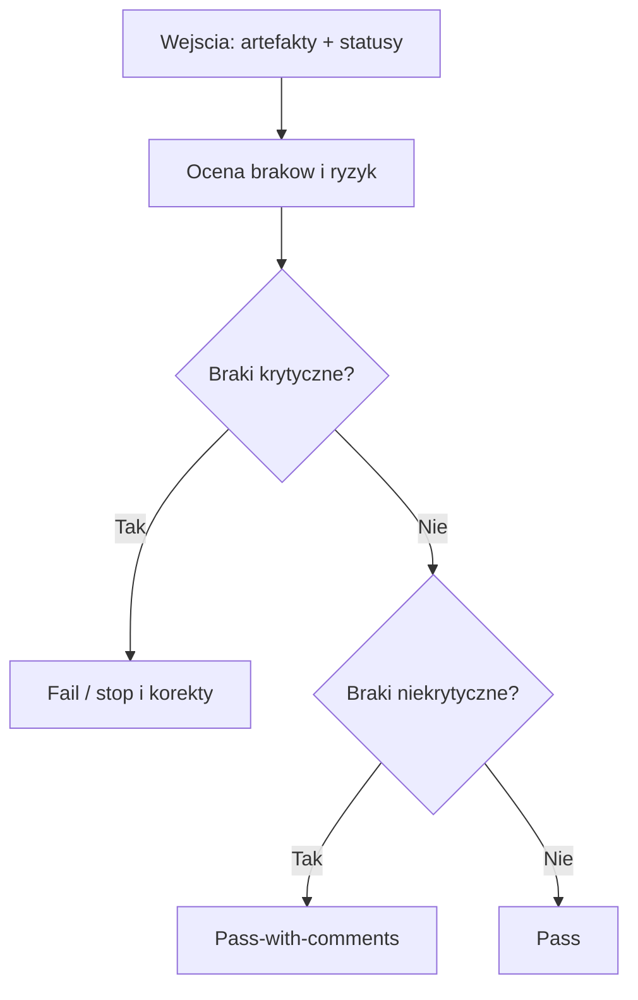

# Dokumentacja systemowa (SAF/LTR)

## Wprowadzenie
To srodowisko to uporzadkowany zestaw procesow, artefaktow i narzedzi wspierajacych badania teoretyczne w ukladzie SAF/LTR. Zostalo utworzone, aby zapewnic powtarzalnosc, audytowalnosc i spojnosc formalna calosci pracy: od kickoffu i hipotezy, przez walidacje i przeglad jakosci, az po decyzje gate. W praktyce oznacza to wspolny standard raportowania, jasne role agentow, kontrolowane progi gate oraz kompletne rejestry decyzji, konfliktow i wynikow. Warstwa LTR (logika, notacja, wyprowadzenia) stabilizuje formalna strone modeli, a warstwa SAF domyka procesowo: rejestry, gate, zgodnosc i odpowiedzialnosc.

Dokumentacja jest przeznaczona dla zespolu badawczego (autorzy, recenzenci) oraz dla osob odpowiedzialnych za jakosc i zgodnosc. Orkiestrator jest agentem systemowym, a nie rola czlowieka w tym rozumieniu. Ma pomoc szybko zrozumiec strukture repozytorium, zakres roli agentow oraz to, gdzie powstaja kluczowe decyzje i slady dowodowe.

## Dla kogo / kiedy uzywac
- Dla autorow i recenzentow: gdy potrzebujesz uporzadkowac hipoteze, notacje i wyprowadzenia oraz utrzymac spojnosc formalna.
- Dla zespolu pracujacego z orkiestratorem (agentem): gdy rozdzielasz zadania, ustawiasz gate i konsolidujesz statusy agentow.
- Dla zespolu QA/zgodnosci: gdy weryfikujesz audytowalnosc, rejestry decyzji i komplet artefaktow.
- Na starcie badania: przy tworzeniu Karty-Badania i konfiguracji projektu.
- Przed Gate 3/4: przy przegladach jakosci, eskalacjach konfliktow i decyzjach gate.

## Zakres i cel
Dokument opisuje konfiguracje systemu w katalogach .github, Dokumentacja i tools. Zawiera szczegolowy opis kazdego pliku, jego roli, kluczowych sekcji i danych. Wszedzie obowiazuje standard raportowania: status OK/Warning/Blocker, pewnosc 0-1 (liczbowa) oraz pytania Q-XXX z priorytetem niski/sredni/wysoki.

## Kontekst biznesowy (dla profesora fizyki)
Ten system nie zmienia tresci merytorycznej, tylko porzadkuje decyzje i ryzyka. Biznesowo oznacza to: mniejsza liczbe bledow w poznych etapach, lepsza audytowalnosc wynikow, szybsze przejscie przez bramki jakosci oraz klarowny podzial odpowiedzialnosci. Dla badacza praktyczna wartosc polega na tym, ze kazdy rezultat ma przypisane zalozenia, poziom pewnosci i slad dowodowy, a spory sa rozstrzygane w sposob powtarzalny.

Mapowanie potrzeb na artefakty:
- Cel badania i zakres -> Karta-Badania, Standard-Operacyjny-Badania.
- Sprawnosc formalna i notacja -> Mapa-Notacji-LTR, Raport-Wyprowadzen-LTR, Rejestr-Walidacji-Formalnej-LTR.
- Wiarygodnosc literaturowa -> Cross-Reference-Log-LTR, tools/arxiv_search.py, tools/ads_search.py.
- Kontrola ryzyka i zgodnosci -> Risk and Safety Pack, Rejestr-Konfliktow-i-Eskalacji.
- Decyzje gate -> Checklista-Research-Gate, Review-Jakosci-Gate3, Podsumowanie-Gate.

W praktyce oznacza to, ze opis plikow w dalszej czesci dokumentu pokazuje nie tylko "co" sie zapisuje, ale tez "po co" to istnieje i jakie ryzyko redukuje.

## Minimalne dane wejsciowe (bez tego nie da sie zaczac)
Ponizej minimalny zestaw informacji i artefaktow, bez ktorych nie da sie uruchomic procesu SAF/LTR:
- Hipoteza i cel badania (co ma byc pokazane/obalone).
- Zakres i wykluczenia (czego swiadomie nie analizujemy).
- Wariant badania (teoretyczna/eksperymentalna/computational).
- Zalozenia krytyczne (co przyjmujemy jako dane/niekwestionowane).
- Karta-Badania (wypelniona na podstawie kickoffu).

Bez tych danych orkiestrator (agent) nie moze ustawic gate, a agenci nie maja podstaw do oceny spojnosci i ryzyk.

## Dane wejsciowe do pracy ciaglej (co przygotowac przed Gate 2/3)
- Experiment Context Pack (teoretyczna): zalozenia, zakres, slowa kluczowe.
- Mapa notacji LTR: definicje, symbole, jednostki.
- Raport-Wyprowadzen-LTR: kroki formalne, tagi EQ:ID.
- Rejestr Walidacji Formalnej LTR: status CAS/reczna dla krokow krytycznych.
- Cross-Reference-Log LTR: powiazania z literatura i poziom zaufania.
- Plan danych / plan walidacji (gdy wystepuja dane lub symulacje).

Braki w powyzszych artefaktach zwykle koncza sie statusem Warning lub Blocker na Gate 2/3.

## Przyklady uzycia (3 przypadki biznesowe)
1) Nowa hipoteza z ryzykiem bledu formalnego
  - Wejscia: Karta-Badania, Mapa-Notacji-LTR, Raport-Wyprowadzen-LTR.
  - Proces: Formal Consistency + Model Review + Rejestr Walidacji.
  - Wynik: decyzja Gate 2 z jasnym statusem i lista korekt.

2) Wynik sprzeczny z literatura
  - Wejscia: Raport-Wyprowadzen-LTR, Cross-Reference-Log LTR, ADS/ArXiv query.
  - Proces: Discovery + Cross-Reference + eskalacja do Model Review.
  - Wynik: rozstrzygniecie konfliktu i aktualizacja Rejestr-Konfliktow-i-Eskalacji.

3) Publikacja lub finansowanie na horyzoncie
  - Wejscia: pelny zestaw artefaktow + Review-Jakosci-Gate3 + Podsumowanie-Gate.
  - Proces: Artifact Quality + Risk Compliance + finalna decyzja gate.
  - Wynik: pass / pass-with-comments / fail z audytowalnym uzasadnieniem.

## Konwencje globalne
- Status roboczy: OK / Warning / Blocker (nie jest decyzja gate).
- Pewnosc: liczba 0-1.
- Pytania: Q-XXX z priorytetem niski/sredni/wysoki.
- Powiazania artefaktow: [ID:Typ].
- Tag rownania: osobna linia EQ:ID.
- [VERIFY-CAS] dla nietrywialnych krokow.

## Slowniczek pojec

### Fizyka i metodologia
- Hipoteza: zdanie robocze podlegajace weryfikacji lub falsyfikacji.
- Zalozenia krytyczne: warunki, bez ktorych model traci sens lub interpretowalnosc.
- Warunki brzegowe: ograniczenia na rozwiazania, determinujace jednoznacznosc wynikow.
- Analiza wymiarowa: kontrola zgodnosci jednostek i skal w rownaniach.
- Rezim przyblizen: zakres parametrow, gdzie uproszczenia sa dozwolone.
- Walidacja formalna: weryfikacja krokow wyprowadzenia (CAS lub reczna).
- CAS: system algebry komputerowej, np. SymPy.
- Cross-reference: powiazanie wyniku z literatura lub benchmarkiem.
- Reproducibility: mozliwosc odtworzenia wyniku przy znanych zalozeniach.

### Copilot i orkiestracja
- Orkiestrator: agent systemowy koordynujacy strumienie i gate (nie rola czlowieka).
- Agent: profil zadaniowy zdefiniowany w .github/agents.
- Prompt: szablon zapytan dla agentow, zwykle zapisuje wynik do Dokumentacja/.
- Instrukcje Copilot: zasady i ograniczenia pracy modelu w repo (.github/copilot-instructions.md).
- Routing modelu: reguly doboru modelu w tools/model_routing.json.
- Model low-cost/premium: poziom kosztu i jakosci przetwarzania; eskalacja wg ryzyka/gate.
- Gate: formalna bramka jakosci (Gate 1-4) z decyzja pass/pass-with-comments/fail.
- Agent-conditional pass: warunkowe przejscie Gate 3 przy niskim ryzyku i braku krytycznych uwag.
- Status roboczy: lokalny status agenta (OK/Warning/Blocker), nie decyzja gate.
- Q-XXX: identyfikator pytania wymagajacego decyzji czlowieka.
- Pewnosc (0-1): liczbowy poziom zaufania do wniosku lub oceny.
- Narzedzie (tool): skrypt pomocniczy wywolywany przez agenta (np. ArXiv/ADS/lint LTR).
- .env: plik z konfiguracja srodowiskowa (np. ADS_API_TOKEN).
- [ID:Typ]: format powiazania artefaktu (np. [LTR-DERIV-001:Raport]).
- [EQ:ID]: tag rownania w raporcie wyprowadzen.

## Diagramy

### 1) Przeglad biznesowy cyklu badania

### 2) Strumienie wartosci (biznesowo)

### 3) Logika decyzji gate (minimalny obraz)

---

## .github/ (konfiguracja agentow i promptow)

### .github/copilot-instructions.md
- Cel: globalne zasady pracy Copilot w repo.
- Sekcje:
  - Zasady ogolne: human-in-the-loop, rozdzial fakt/wniosek, DO_UZUPELNIENIA.
  - Artefakty i formaty: standard raportowania, tagi, [ID:Typ], ADS_API_TOKEN w .env.
  - LTR: wymagania formalne, spojnosc notacji, PDF tekst layer.
  - Jakosci i gate: zasady Gate 1/2/3/4, status roboczy vs gate.
  - Zaleznosci agentow: Formal->Model, Data->Stats, Discovery->Cross-Ref, QA konsoliduje.
  - Zachowanie modelu: brak halucynacji, zgoda na edycje, Miejsca do doprecyzowania.
- Doprecyzowac: progi confidence, zakres dopuszczalnych automatyzacji, definicje ryzyka.
- Cel biznesowy: zapewnienie jednolitego sposobu pracy i kontroli jakosci w calym repozytorium.

### .github/agents/
Kazdy plik agenta ma: Misja, Rola i poziom, Model, Zadania, Wejscia, Wyjscia, Standard raportowania, Zaleznosci, Kryteria blokujace, Guardrails, Miejsca do doprecyzowania.

#### .github/agents/research-orkiestrator.agent.md
- Misja: zarzadzanie cyklem badania od hipotezy do publikacji.
- Model: low-cost; eskalacja premium dla Gate 3/4, sporow merytorycznych lub brakow krytycznych danych.
- Zadania: podzial na strumienie (discovery/model/walidacja/raport), pilnowanie przejsc gate, dobor modelu (tools/route_model.py), zlecanie zadan z wejsciami, uzgadnianie kolejnego kroku z czlowiekiem, monitor pass_with_notes, utrzymanie progow confidence, agregacja statusow i Q-XXX, koordynacja eskalacji.
- Wejscia: Karta badania, Research Design, Plan walidacji, pakiety teoretyczne, Checklista Research Gate.
- Wyjscia: plan strumieni, lista brakow gate, sugestie kolejnych krokow, lista zleconych zadan z priorytetem i modelem, raport statusow, lista pytan Q-XXX.
- Standard raportowania: OK/Warning/Blocker; pewnosc 0-1; Q-XXX z priorytetem.
- Definicje statusow: OK/Warning/Blocker.
- Zaleznosci i reguly: Formal->Model, Data->Stats, Discovery->Cross-Ref, Artifact Quality konsoliduje.
- Zawiera: macierz zaleznosci, flow gate, checklisty gate per agent.
- Doprecyzowac: wlasciciele gate, limity pass_with_notes, kryteria eskalacji.
- Cel biznesowy: utrzymanie kontroli nad ryzykiem i kosztami badania oraz spojnosc decyzji gate.

#### .github/agents/formal-consistency.agent.md
- Misja: spojnosc notacji i logiki dokumentu.
- Rola i poziom: formalny recenzent aparatu matematycznego; poziom profesor.
- Model: premium; low-cost dla prostych kontroli (np. tagi, checklista).
- Zadania: weryfikacja definicji i notacji, zgodnosc z mapa notacji, [VERIFY-CAS], tagi LTR, jednostki, struktura rozumowania, zgodnosc z Experiment Context Pack.
- Wyjscia: tabela niespojnosci, tabela krokow [VERIFY-CAS], tabela pytan do orkiestratora, lista DO_UZUPELNIENIA.
- Kryteria blokujace: brak definicji obiektu, sprzecznosc jednostek, ID bez mapy notacji, niezgodnosc zalozen z Experiment Context Pack.
- Zawiera: szablony macierzy eskalacji i pytan do orkiestratora.
- Doprecyzowac: tolerancje notacyjne, zakres czasowy kontroli, zakres domeny.
- Cel biznesowy: redukcja bledow formalnych i kosztu poprawek na poznych etapach.

#### .github/agents/model-review.agent.md
- Misja: poprawnosc formalna i fizyczna modelu.
- Rola i poziom: recenzent poprawnosci fizycznej; poziom profesor.
- Model: premium; low-cost dla zadan prostych.
- Zadania: weryfikacja rownan LaTeX, zalozen i warunkow brzegowych, spojnosci notacji, zasad zachowania, analiza wymiarowa, identyfikacja niejawnych zalozen.
- Wyjscia: tabela niespojnosci, tabela sugestii korekt, tabela pytan do orkiestratora, lista DO_UZUPELNIENIA.
- Kryteria blokujace: naruszenie zasad zachowania, brak warunkow brzegowych, sprzecznosc jednostek, niezgodnosc zalozen z Experiment Context Pack.
- Zaleznosci: konflikty notacji -> Formal Consistency; dane -> Data Quality.
- Doprecyzowac: krytyczne sekcje, rezymy przyblizen, wariant badania.
- Cel biznesowy: zabezpieczenie poprawnosci merytorycznej wynikow przed publikacja/finansowaniem.

#### .github/agents/physics-discovery.agent.md
- Misja: mapowanie literatury i luk badawczych.
- Rola i poziom: recenzent stanu wiedzy; poziom profesor.
- Model: low-cost; eskalacja premium dla krytycznych luk lub sporow.
- Zadania: przeglad ArXiv/ADS/DOI, mapa hipotez, pytania otwarte, identyfikacja zalozen, oznaczanie zaufania i typu zrodla.
- Wyjscia: tabela prac powiazanych, mapa hipotez, tabela pytan otwartych, lista DO_UZUPELNIENIA.
- Kryteria blokujace: brak hipotezy lub zakresu, brak slow kluczowych, sprzecznosc zalozen z Experiment Context Pack.
- Zaleznosci: wyniki -> Cross-Reference; spory -> Cross-Reference i Model Review.
- Doprecyzowac: preferowane zrodla, filtry literatury, konfiguracja ADS.
- Cel biznesowy: minimalizacja ryzyka powielania pracy i pomijania krytycznej literatury.

#### .github/agents/cross-reference.agent.md
- Misja: laczenie tekstu z literatura swiatowa.
- Rola i poziom: analityk powiazan z literatura i benchmarkami; poziom profesor.
- Model: low-cost; eskalacja premium dla sporow interpretacyjnych.
- Zadania: mapowanie fragmentow na ArXiv/ADS/DOI, oznaczanie podobienstw i rozbieznosci, uruchamianie tools/arxiv_search.py i tools/ads_search.py po zleceniu przez orkiestratora.
- Wejscia: raport wyprowadzen, cross-reference log, zapytania i slowa kluczowe, parametry wyszukiwania (max, kategorie), Experiment Context Pack.
- Wyjscia: tabela powiazan, wyniki ArXiv/ADS (tabele Markdown), tabela pytan do orkiestratora, lista DO_UZUPELNIENIA.
- Kryteria blokujace: brak zapytan/slow kluczowych lub parametrow wyszukiwania.
- Klasyfikacja: typ preprint/peer-reviewed/raport/inne; zrodlo ArXiv/ADS/Crossref/manualne.
- Doprecyzowac: domyslne kategorie ArXiv, reguly filtrowania, wariant badania.
- Cel biznesowy: zwiekszenie wiarygodnosci i sledowalnosci odniesien.

#### .github/agents/simulation-experiment.agent.md
- Misja: projektowanie weryfikacji numerycznej i wariantow obliczen.
- Rola i poziom: projektant weryfikacji numerycznej i testow wrazliwosci; poziom profesor.
- Model: low-cost; eskalacja premium dla zlozonych modeli lub krytycznych decyzji.
- Zadania: scenariusze testowe, parametry, warianty obliczen i testy wrazliwosci, metryki jakosci i zbieznosci.
- Wyjscia: tabela scenariuszy, tabela parametrow, plan wariantow i testow zbieznosci, tabela pytan, lista DO_UZUPELNIENIA.
- Kryteria blokujace: brak zakresu parametrow lub metryk zbieznosci, niewykonalne wymagania obliczeniowe.
- Wymagania raportowe: kazdy scenariusz i parametr wskazuje lokalizacje (sekcja/ID).
- Zaleznosci: Data Quality i Statistics Review.
- Doprecyzowac: narzedzia symulacyjne, budzet obliczeniowy, metryki zbieznosci.
- Cel biznesowy: kontrola kosztu obliczen i ryzyka niejednoznacznej walidacji.

#### .github/agents/data-quality.agent.md
- Misja: detekcja anomalii w danych wejsciowych i wynikowych.
- Rola i poziom: recenzent jakosci danych; poziom profesor.
- Model: low-cost; eskalacja premium dla danych krytycznych.
- Zadania: walidacja brakow, outliery, drift, spojnosc parametrow, komplet metadanych.
- Wyjscia: tabela jakosci danych, tabela pytan, lista DO_UZUPELNIENIA.
- Kryteria blokujace: brak kluczowych danych, niezgodnosc zakresow z Experiment Context Pack.
- Wymagania raportowe: kazdy problem wskazuje lokalizacje (sekcja/ID lub zestaw danych).
- Zaleznosci: wyniki -> Statistics Review; konflikty metryk -> Statistics Review.
- Doprecyzowac: progi akceptacji, definicje danych krytycznych, reguly driftu.
- Cel biznesowy: ograniczenie ryzyka blednych wnioskow przez slabe dane.

#### .github/agents/statistics-review.agent.md
- Misja: kwantyfikacja pewnosci wynikow.
- Rola i poziom: recenzent metod statystycznych; poziom profesor.
- Model: premium; low-cost dla prostych testow.
- Zadania: dobor testow, CI, wrazliwosc, rekomendacja progow confidence (0.85/0.70/0.50), weryfikacja zalozen testow i ryzyk bledow wielokrotnych.
- Wyjscia: tabela niepewnosci (ID | metryka | CI | zalozenia | ryzyko | pewnosc | status), tabela pytan, lista DO_UZUPELNIENIA.
- Kryteria blokujace: brak metryk/CI, brak uzasadnienia testu, brak weryfikacji zalozen.
- Zaleznosci: wymaga Data Quality, wyniki -> Artifact Quality.
- Doprecyzowac: preferowane metody, minimalne testy, reguly bledow wielokrotnych.
- Cel biznesowy: zapewnienie wiarygodnych wnioskow i decyzji gate.

#### .github/agents/risk-compliance.agent.md
- Misja: mitygacja ryzyk metodologicznych i operacyjnych.
- Rola i poziom: recenzent ryzyk i zgodnosci; poziom profesor.
- Model: low-cost; eskalacja premium dla danych wrazliwych lub ryzyk wysokich.
- Zadania: ryzyka regulacyjne i etyczne, zgodnosc z polityka danych, placeholder wymagan regulatora, poziom ryzyka i priorytety mitygacji.
- Wyjscia: tabela ryzyk (ID | ryzyko | poziom | mitygacja | wlasciciel | pewnosc), tabela pytan, lista DO_UZUPELNIENIA.
- Kryteria blokujace: brak polityki danych przy danych wrazliwych, brak zgody na przetwarzanie danych.
- Wymagania raportowe: kazde ryzyko ma wlasciciela i termin mitygacji (jesli dotyczy).
- Zaleznosci: krytyczne ryzyka -> Artifact Quality.
- Doprecyzowac: polityka danych, progi ryzyk, wymagania regulatora/finansujacego.
- Cel biznesowy: ograniczenie ryzyk regulacyjnych i reputacyjnych.

#### .github/agents/artifact-quality.agent.md
- Misja: koncowa kontrola jakosci przed wysylka.
- Rola i poziom: recenzent kompletnosci i spojnosci artefaktow; poziom profesor.
- Model: premium; low-cost dla wstepnej kontroli kompletnosci.
- Zadania: spojnosc artefaktow, status pass/pass-with-comments/fail, weryfikacja pakietow teoretycznych.
- Wyjscia: status gate z uzasadnieniem, tabela brakow, tabela pytan, lista DO_UZUPELNIENIA.
- Definicje statusow: pass / pass-with-comments / fail.
- Kryteria blokujace: brak kluczowego artefaktu, sprzecznosc miedzy raportami, brak mapy notacji, brak raportu wyprowadzen.
- Zaleznosci: Formal Consistency + Model Review + Statistics Review + Risk Compliance.
- Doprecyzowac: kryteria pass i pass-with-comments, priorytety brakow.
- Cel biznesowy: jednoznaczna decyzja gate oparta o komplet dowodow.

#### .github/agents/knowledge-repo.agent.md
- Misja: pamiec instytucjonalna i reuse.
- Rola i poziom: kurator wiedzy i spojnosc zalozen; poziom profesor.
- Model: low-cost; eskalacja premium dla krytycznych konfliktow zalozen.
- Zadania: indeksowanie wynikow, wykrywanie duplikacji, konsolidacja zalozen, normalizacja nazw i ID.
- Wyjscia: tabela rekomendacji reuse, tabela kandydatow do konsolidacji, tabela pytan, lista DO_UZUPELNIENIA.
- Zaleznosci: konsolidacje -> Formal Consistency.
- Doprecyzowac: kryteria podobienstwa i reguly konsolidacji.
- Cel biznesowy: redukcja duplikacji pracy i utrzymanie spojnosc wiedzy.

#### .github/agents/socratic-mentor.agent.md
- Misja: krytyczny sparring partner.
- Rola i poziom: recenzent luk i sprzecznosci; poziom profesor.
- Model: low-cost; eskalacja premium dla krytycznych hipotez lub Gate 3.
- Zadania: pytania o przypadki graniczne, sprzecznosci, uproszczenia i ich konsekwencje, rozdzial sprzecznosci formalne/fizyczne/metodologiczne.
- Wyjscia: tabela pytan krytycznych, lista DO_UZUPELNIENIA.
- Kryteria blokujace: sprzecznosc zalozen z zakresem badania, brak warunkow brzegowych.
- Zaleznosci: konflikty formalne -> Formal Consistency; fizyczne -> Model Review.
- Doprecyzowac: definicja krytycznej hipotezy, obszary wysokiego ryzyka.
- Cel biznesowy: wczesne wykrywanie sprzecznosci ograniczajace koszty zmian.

### .github/prompts/

#### kickoff-badania.prompt.md
- Cel: minimalne informacje startowe.
- Pytania: hipoteza i cel, zakres i wykluczenia, preferowane zrodla literatury, ADS_API_TOKEN w .env, tryb pracy, krytyczne zalozenia, wariant badania, charakter obliczen/symulacji, standard raportowania, pytania Q-XXX.
- Wyjscie: karta badania + lista brakow Gate 1.
- Zapis: Dokumentacja/Karta-Badania.md.
- Doprecyzowac: docelowy zakres i priorytety pytan startowych.
- Cel biznesowy: szybki i jednolity start projektu bez brakow Gate 1.

#### konfigurator-projektu-badawczego.prompt.md
- Cel: pelna konfiguracja projektu i agentow.
- Pytania: nazwa projektu, case, artefakty i powiazane ID, pakiety teoretyczne, ADS_API_TOKEN, domena i klasa obiektow, rezymy przyblizen, notacja lokalna vs formalna, krytyczne sekcje/rownania, tolerancje notacyjne, zaleznosci agentow, wlasciciele gate, polityka danych, konfiguracja narzedzi (OCR/Graphviz/ADS).
- Wyjscie: lista plikow i powiazan.
- Zapis: Dokumentacja/Rejestr-Konfiguracji-Projektu.md.
- Doprecyzowac: domyslne pakiety, polityka danych, konfiguracja narzedzi.
- Cel biznesowy: kompletna konfiguracja ograniczajaca ryzyko brakow w trakcie gate.

#### review-jakosci-badania.prompt.md
- Cel: Gate 3 i spojnosc artefaktow.
- Sprawdzenia: fakt/wniosek, [VERIFY-CAS], notacja, konflikty agentow, statusy robocze.
- Wyjscie: status pass/pass-with-comments/fail + braki + pewnosc + konflikty.
- Zapis: Dokumentacja/Review-Jakosci-Gate3.md.
- Doprecyzowac: krytyczne kryteria Gate 3 i progi akceptacji.
- Cel biznesowy: spójny przeglad jakosci przed decyzja gate.

#### eskalacja-konfliktow.prompt.md
- Cel: rozstrzyganie konfliktow agentow.
- Sprawdzenia: notacja, fizyka, dane, statystyka.
- Wyjscie: decyzja eskalacyjna + uzasadnienie + Q-XXX.
- Zapis: Dokumentacja/Rejestr-Konfliktow-i-Eskalacji.md.
- Doprecyzowac: priorytety i progi eskalacji.
- Cel biznesowy: szybkie i udokumentowane rozstrzyganie sporow.

#### konsolidacja-statusow.prompt.md
- Cel: zbiorcze podsumowanie statusow.
- Zbiera: statusy, pewnosc, pytania Q-XXX.
- Wyjscie: tabela statusow + lista pytan + rekomendacja.
- Zapis: Dokumentacja/Konsolidacja-Statusow.md.
- Doprecyzowac: format rekomendacji i prog ostrzezen.
- Cel biznesowy: jeden obraz ryzyka i stanu projektu dla decyzji gate.

#### podsumowanie-gate.prompt.md
- Cel: decyzja gate.
- Wejscia: raporty agentow, lista brakow, statusy OK/Warning/Blocker.
- Wyjscie: decyzja gate (pass/pass-with-comments/fail) + uzasadnienie + lista brakow + pewnosc.
- Zapis: Dokumentacja/Podsumowanie-Gate.md.
- Doprecyzowac: kryteria decyzji oraz akceptowalne braki.
- Cel biznesowy: formalna, audytowalna decyzja gate.

---

## tools/ (narzedzia CLI)

### tools/arxiv_search.py
- Cel: wyszukiwanie ArXiv i formatowanie tabeli Markdown.
- Wejscia CLI:
  - query (obowiazkowe)
  - --max (liczba wynikow)
  - --cat (powtarzalne kategorie ArXiv)
- Wyjscie: naglowek z data i zapytaniem, opcjonalne kategorie oraz tabela (ArXiv ID, Data, Autorzy, Tytul, URL).
- Zaleznosci: biblioteka arxiv.
- Doprecyzowac: domyslne kategorie i limit wynikow.
- Cel biznesowy: szybkie uzyskanie przegladu literatury bez pracy recznej.

### tools/ads_search.py
- Cel: wyszukiwanie ADS i formatowanie tabeli Markdown.
- Wejscia CLI:
  - query (obowiazkowe)
  - --max (liczba wynikow)
- Wejscia srodowiskowe:
  - ADS_API_TOKEN w .env lub env (narzedzie wczytuje .env z katalogu repozytorium).
- Wyjscie: naglowek z data i zapytaniem oraz tabela (ADS Bibcode, Rok, Autorzy, Tytul, DOI, URL).
- Zaleznosci: ADS API, token Bearer; blad zwraca kod 2.
- Doprecyzowac: standard zapytan i dobor pol wynikowych.
- Cel biznesowy: dostep do literatury premium i wzrost wiarygodnosci przegladu.

### tools/lint_ltr.py
- Cel: walidacja tagow LTR w plikach .md.
- Sprawdza:
  - format tagu [EQ:ID] (linia musi zawierac tylko poprawny tag)
  - format powiazan [ID:Typ] w liniach z "Powiazane artefakty" lub "Powiazany"
- Wyjscie: lista ostrzezen lub "brak ostrzezen"; z --fail-on-warning zwraca kod 1.
- Uwagi: pomija .git i .venv.
- Doprecyzowac: dodatkowe reguly walidacji tagow i sekcji.
- Cel biznesowy: automatyczne wykrywanie bledow formatowania LTR.

### tools/route_model.py
- Cel: wybor modelu na podstawie agenta, gate i ryzyka.
- Wejscia CLI: agent, --gate, --risk, --config.
- Wyjscie: nazwa modelu (string).
- Zaleznosc: tools/model_routing.json.
- Doprecyzowac: reguly eskalacji i mapowanie agentow.
- Cel biznesowy: kontrola kosztow i ryzyka przez automatyczny dobor modelu.

### tools/model_routing.json
- Cel: konfiguracja trasowania modeli.
- Zawiera: domyslny model, reguly eskalacji (gate 3/4, risk high) oraz nadpisania per agent.
- Doprecyzowac: progi ryzyka i wyjatki per agent.
- Cel biznesowy: przewidywalny koszt i jakosc pracy agentow.

---

## Dokumentacja/

### Dokumentacja/Instrukcja-Uzycia.md
- Opisuje MVP i pelny flow (PL/EN).
- Wskazuje pliki rejestrow (Karta-Badania, Rejestry, Podsumowania).
- Zawiera standard raportowania, ADS_API_TOKEN w .env i zasady gate.
- Ma sekcje "Rola orkiestratora" i "Orchestrator role" (opis roli agenta w przeplywie).
- Doprecyzowac: kroki onboardingowe i minimalne definicje artefaktow.
- Cel biznesowy: szybkie wdrozenie nowych osob i unifikacja procesu.

### Dokumentacja/Artefakty-Wymagania.md
- Lista artefaktow MVP i pelnych (PL/EN).
- Wymagania gate 2/3/4 oraz powiazania z raportami.
- Doprecyzowac: warianty artefaktow i minimalne wymagania per gate.
- Cel biznesowy: redukcja brakow formalnych w gate.

### Dokumentacja/Karta-Badania.md
- Jednoznaczny zapis kickoffu.
- Zawiera tylko naglowek i opis "Nie usuwac" (pliki wypelniane w trakcie badan).
- Doprecyzowac: pola kickoffu, hipoteza, zakres, zalozenia.
- Cel biznesowy: szybka identyfikacja celu i zakresu projektu.

### Dokumentacja/Rejestr-Konfiguracji-Projektu.md
- Rejestr konfiguracji (powiazany z promptem konfiguratora).
- Naglowek i opis "Nie usuwac".
- Doprecyzowac: lista artefaktow, zaleznosci i konfiguracje narzedzi.
- Cel biznesowy: spojnosc konfiguracji projektu i audytowalnosc.

### Dokumentacja/Rejestr-Konfliktow-i-Eskalacji.md
- Rejestr konfliktow agentow i decyzji eskalacyjnych.
- Naglowek i opis "Nie usuwac".
- Doprecyzowac: klasy konfliktow, wlasciciele decyzji, terminy.
- Cel biznesowy: kontrola ryzyk i przejrzystosc decyzji.

### Dokumentacja/Konsolidacja-Statusow.md
- Konsolidacja statusow OK/Warning/Blocker.
- Naglowek i opis "Nie usuwac".
- Doprecyzowac: format tabeli statusow i logika rekomendacji.
- Cel biznesowy: jednolity obraz stanu projektu dla zarzadzania.

### Dokumentacja/Review-Jakosci-Gate3.md
- Review gate 3, lista brakow i pewnosc.
- Naglowek i opis "Nie usuwac".
- Doprecyzowac: kryteria Gate 3 i akceptowalne braki.
- Cel biznesowy: formalny przeglad jakosci przed kluczowa decyzja.

### Dokumentacja/Podsumowanie-Gate.md
- Podsumowanie gate z decyzja i uzasadnieniem.
- Naglowek i opis "Nie usuwac".
- Doprecyzowac: typ decyzji, uzasadnienia i powiazane dowody.
- Cel biznesowy: audytowalna decyzja przejscia lub zatrzymania projektu.

### Dokumentacja/SAF.png
- Schemat SAF (grafika).
- Doprecyzowac: wersja z podpisami lub legenda.
- Cel biznesowy: szybka komunikacja procesu interesariuszom.

### Dokumentacja/SAF_PL.png
- Schemat SAF (wersja PL).
- Doprecyzowac: wersja z podpisami lub legenda.
- Cel biznesowy: szybka komunikacja procesu interesariuszom (PL).

### Dokumentacja/Szablon-LTR/

#### Kontrakt-Semantyczny-LTR.md
- Metadane: ID, tytul, autor, data, status, tryb pracy, zakres.
- Cel kontraktu: zakres kontroli formalnej.
- Definicje i notacja: definicje, symbole, znaczenie, jednostki.
- Zalozenia: Z1, Z2.
- Tezy: status, pewnosc (0-1), warunki.
- Ograniczenia i zakres.
- Pytania otwarte Q-XXX z priorytetem.
- Walidacja formalna: kroki do CAS/recznej weryfikacji oraz punkty niepewne.
- Tryby sekcji: [TRYB: FORMALNY]/[TRYB: BADACZ].
- Doprecyzowac: zakres kontraktu, definicje, tezy i warunki.
- Cel biznesowy: jednoznaczne ustalenie ram formalnych modelu.

#### Raport-Wyprowadzen-LTR.md
- Metadane i powiazany kontrakt [ID:Typ].
- Cel wyprowadzenia, zalozenia, definicje.
- Tryb formalny: kroki, uzasadnienia, walidacja (CAS/reczna).
- Tryb badacz: notatki.
- Wynik, zakres stosowalnosci, pewnosc (0-1).
- Luki i pytania otwarte.
- Doprecyzowac: kroki wyprowadzenia, walidacje CAS/reczne.
- Cel biznesowy: powtarzalnosc i weryfikowalnosc wyprowadzen.

#### Rejestr-Walidacji-Formalnej-LTR.md
- Metadane, powiazany raport, CAS.
- Tabela krokow: Krok/Opis/Metoda/Status/Komentarz/Pewnosc.
- Wynik walidacji i slad dowodowy.
- Doprecyzowac: lista krokow, metoda i status walidacji.
- Cel biznesowy: dowod formalnej poprawnosci krokow krytycznych.

#### Checklista-Gate3-Teoria-LTR.md
- Metadane.
- Kryteria MUSI i POWINNO.
- Decyzja: status pass/pass-with-comments/fail, komentarz, pewnosc 0-1.
- Doprecyzowac: kryteria MUSI/POWINNO dla danego projektu.
- Cel biznesowy: jednoznaczne kryteria Gate 3 dla teorii.

#### Mapa-Notacji-LTR.md
- Metadane.
- Globalne zalozenia jednostkowe.
- Slownik symboli z jednostkami i zrodlem definicji.
- Reguly notacji i log zmian.
- Doprecyzowac: globalne zalozenia jednostkowe i symbole.
- Cel biznesowy: eliminacja bledow notacji i konfliktow formalnych.

#### Cross-Reference-Log-LTR.md
- Metadane.
- Tabela powiazan z literatura: zrodlo/rok/typ/podobienstwo/rozbieznosci/pewnosc (0-1).
- Wnioski i decyzje.
- Doprecyzowac: powiazania z literatura i poziom zaufania.
- Cel biznesowy: ugruntowanie wynikow w literaturze i identyfikacja luk.

#### README.md (Szablon-LTR)
- Zasady pracy, tryby, tagi, status walidacji, pewnosc 0-1, status roboczy, Q-XXX.
- Doprecyzowac: wyjatki od standardu i lokalne zasady zespolu.
- Cel biznesowy: spojnosc sposobu tworzenia artefaktow LTR.

### Dokumentacja/Szablon-Fizyka/

#### Standard-Operacyjny-Badania.md
- Metadane.
- Cel, zakres, hipoteza, wariant badania.
- Role i odpowiedzialnosci (PI, Research Physicist, Statistics Reviewer).
- Quality Gates i zasady progresywnych bramek (w tym limity pass-with-comments).
- Standard raportowania (status/pewnosc/Q-XXX).
- Artefakty wymagane (w tym pakiety teoretyczne).
- Pole na powiazane decyzje.
- Doprecyzowac: role, gate i wymagane artefakty w danym projekcie.
- Cel biznesowy: formalizacja procesu badawczego i odpowiedzialnosci.

#### Standard-Operacyjny-Research-Design.md
- Metadane.
- Model i zalozenia.
- Parametry i przestrzen przeszukiwania.
- Warunki brzegowe.
- Metody walidacji.
- Wymagania CAS ([VERIFY-CAS]) i powiazane artefakty [ID:Typ].
- Doprecyzowac: model, parametry, warunki brzegowe, walidacje.
- Cel biznesowy: spojnosc projektu badania z pozostalymi artefaktami.

#### Checklista-Research-Gate.md
- Metadane.
- Gate 1/2/3/4 checklisty z konkretnymi kontrolami.
- Decyzja: status, komentarz, pewnosc 0-1.
- Doprecyzowac: progi i szczegoly kontroli w Gate 1-4.
- Cel biznesowy: uporzadkowane przejscie przez bramki jakosci.

#### Sekcje-Akceptacje-Decyzje.md
- Akceptacje: status, podpisy, data, powiazane Q-XXX.
- Decyzje: tabela z ID, uzasadnieniem, ownerem, statusem, pewnoscia.
- Doprecyzowac: wlasciciele decyzji i powiazane Q-XXX.
- Cel biznesowy: sledowalnosc decyzji i akceptacji.

#### README.md (Szablon-Fizyka)
- Zasady ogolne, rozdzial fakt/wniosek, standard raportowania.
- Lista szablonow i pakietow artefaktow (teoretyczna).
- Doprecyzowac: warianty pracy i lokalne uzgodnienia zespolu.
- Cel biznesowy: wspolny standard dokumentow w fizyce teoretycznej.

---

## Uwagi o narzedziach zewnetrznych
- ADS wymaga ADS_API_TOKEN w .env.
- ArXiv wymaga biblioteki arxiv.
- LTR lint sprawdza tylko formaty tagow (nie waliduje merytoryki).
