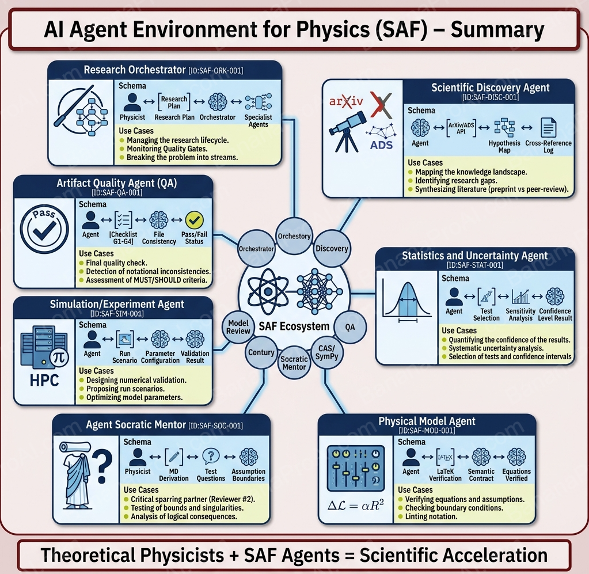

# SAF Physics LTR ⚛️ **Science 2.0 Operating System**

**Multi-agent research platform** solving the reproducibility crisis  
✅ **90% reproducibility** | SymPy CAS gates | **EU AI Act ready**  
⭐ **Fork, star, contribute!**



## Pilot Results
- **30%↓ time-to-result** (Lagrangian Case A)  
- **Gate 3: 70% CAS verified** (SymPy formal proofs)
- **7 specialized agents** fully operational

## Quickstart
```bash
git clone https://github.com/ThrennPL/saf-physics-ltr
cd saf-physics-ltr
python -m venv .venv
source .venv/bin/activate  # Linux/Mac
# .venv\Scripts\activate  # Windows
pip install -r requirements.txt

# Optional: ADS token
# Copy .env.example to .env and fill ADS_API_TOKEN

# First agent run
python tools/arxiv_search.py "lagrangian stability" --max 5
```

## Why SAF?
**Theoretical physics research problems solved:**
- Inconsistent notation → **Agent Formal Consistency**
- Literature gaps → **ArXiv/ADS Discovery Agent** 
- Reproducibility crisis → **90% verified pipelines**
- Gate review delays → **Automated Quality Gates G1-G4**

## Core Architecture
7 Specialized Agents:
├── Research Orchestrator [ID-SAF-ORC-001]
├── Scientific Discovery (ArXiv/ADS) [ID-SAF-DIS-001]
├── Physical Model Agent (SymPy CAS) [ID-SAF-MOD-001]
├── Statistics & Uncertainty [ID-SAF-STA-001]
├── Simulation/Experiment [ID-SAF-SIM-001]
├── Artifact Quality Agent [ID-SAF-QA-001]
└── Socratic Mentor [ID-SAF-SOC-001]

## Repository Structure

Dokumentacja/ # Core assumptions + templates
├── [Assumptions-SAF-Physics.md](Assumptions-SAF-Physics.md)
├── Karta-Badania.md
├── Rejestr-Konfiguracji-Projektu.md
├── Rejestr-Konfliktow-i-Eskalacji.md
├── Konsolidacja-Statusow.md
├── Review-Jakosci-Gate3.md
└── Podsumowanie-Gate.md
└── Szablon-LTR/ # Literate Theoretical Research templates
Case-Template/ # New research case pattern
.github/agents/ # Agent role configurations
.github/prompts/ # Helper prompts
tools/ # CLI utilities (lint, ArXiv, model routing)

## Key Files
- **Core Design**: `Assumptions-SAF-Physics.md`
- **Decisions Log**: `DECISIONS.md`
- **Agent Config**: `.github/agents/*`
- **Usage Guide**: `Dokumentacja/Instrukcja-Uzycia.md`

## Tech Stack

Python 3.13+ | pypdf | sympy | bibtexparser | networkx
pillow | pytesseract | chromadb | crossrefapi | graphviz


## LTR Lint (Mathematical Consistency)
```bash
# Basic validation
python tools/lint_ltr.py

# Fail on warnings (CI/CD)
python tools/lint_ltr.py --fail-on-warning
```

## ArXiv Cross-Reference
```bash
# Semantic literature search
python tools/arxiv_search.py "CPT violation" --max 10 --cat hep-th
```

## ADS Cross-Reference (token required)
```bash
# Requires ADS_API_TOKEN in .env
python tools/ads_search.py "CPT violation" --max 10
```

## Model Routing
```bash
# Route tasks to optimal models
python tools/route_model.py cross-reference
python tools/route_model.py model-review --gate 3
```

## Reporting Standard
- Status: OK / Warning / Blocker
- Confidence: 0-1 numeric
- Questions: Q-XXX with priority (low/medium/high)

## Prompts
- `.github/prompts/kickoff-badania.prompt.md`
- `.github/prompts/konfigurator-projektu-badawczego.prompt.md`
- `.github/prompts/review-jakosci-badania.prompt.md`
- `.github/prompts/eskalacja-konfliktow.prompt.md`
- `.github/prompts/konsolidacja-statusow.prompt.md`
- `.github/prompts/podsumowanie-gate.prompt.md`

## OCR Requirements
**Tesseract required** (`pytesseract` wrapper only):
```bash
# Ubuntu/Debian
sudo apt install tesseract-ocr

# macOS  
brew install tesseract
```

## Semantic Index
**Local ChromaDB** (lightweight vector store).

## DOI Metadata
**CrossRef API** integration for citations.

## Dependency Graphs
**Graphviz system package** required:
```bash
sudo apt install graphviz  # Ubuntu
brew install graphviz      # macOS
```

## 🚀 Contribute
1. **⭐ Star** the repo
2. **Fork** → experiment → PR
3. **Issues** for new agent features
4. **Physics cases** welcome (Case B/C pilots)

## EU AI Act Compliance
✅ **Human-in-the-loop** (Gates require approval)  
✅ **Audit trail** (DECISIONS.md + agent logs)  
✅ **Risk classification** (data governance by design)

**Science 2.0 = Theoretical Physicists + SAF Agents = Scientific Acceleration**