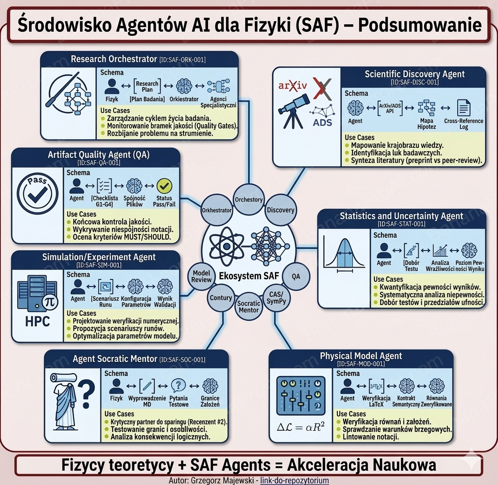

# SAF Physics LTR


Repozytorium modelu Srodowiska Agentow AI dla Fizyki (SAF) w podejsciu Literate Theoretical Research (LTR).


## Szybki start
1. Utworz i aktywuj srodowisko Python (`.venv`).
2. Zainstaluj zaleznosci uruchomieniowe: `pip install -r requirements.txt`.
3. (Opcjonalnie, dla jakosci i CI) Zainstaluj zaleznosci developerskie: `pip install -r requirements-dev.txt`.
4. (Opcjonalnie) Wlacz hook pre-commit: `pre-commit install`.
5. Opcjonalnie: skopiuj `.env.example` do `.env` i ustaw ADS_API_TOKEN.
6. Uruchom kontrole sanity dla security/MCP: `python tools/security_sanity_check.py`.

```bash
git clone https://github.com/ThrennPL/saf-physics-ltr
cd saf-physics-ltr
python -m venv .venv
source .venv/bin/activate  # Linux/Mac
# .venv\Scripts\activate  # Windows
pip install -r requirements.txt

# Opcjonalnie: zaleznosci developerskie (lint/test/typecheck/build)
pip install -r requirements-dev.txt

# Opcjonalnie: wlacz pre-commit (bramka dryfu MCP)
pre-commit install

# Opcjonalnie: ADS token
# Skopiuj .env.example do .env i ustaw ADS_API_TOKEN

# Sanity check security/MCP
python tools/security_sanity_check.py

# Pierwsze uruchomienie narzedzia
python tools/arxiv_search.py "lagrangian stability" --max 5
```


## Minimalne dane startowe (wymagane)
- Hipoteza i cel badania.
- Zakres i wykluczenia.
- Wariant badania (teoretyczna/eksperymentalna/obliczeniowa).
- Zalozenia krytyczne.
- Wypelniona `Dokumentacja/Karta-Badania.md`.


## Dlaczego SAF?
**Problemy badan teoretycznych, ktore rozwiazuje:**
- Niespojna notacja → **Agent Formal Consistency**
- Luki w literaturze → **Discovery (ArXiv/ADS)**
- Problemy reprodukowalnosci → **Walidacja LTR i kontrole formalne**
- Opoznienia przegladow → **Bramki jakosci Gate 1-4**


## Architektura (agenci)
14 wyspecjalizowanych agentow:
- Research Orchestrator: routing strumieni, przejscia gate, agregacja statusow.
- Formal Consistency: spojnosc notacji/ID i rozstrzyganie konfliktow notacyjnych.
- Model Review: rozstrzyganie konfliktow fizycznych i merytorycznych.
- Physics Discovery: definiowanie kierunku rozpoznania i pytan badawczych.
- Cross-Reference: mapowanie literatury ArXiv/ADS i powiazan dowodowych.
- Data Quality: kontrola jakosci danych przed analiza niepewnosci.
- Statistics Review: ocena niepewnosci/CI i odpornosci wnioskowania.
- Risk & Compliance: kontrola ryzyk i warunkow fail-closed.
- Simulation/Experiment: przygotowanie wariantow wykonania i reprodukowalnosci.
- Socratic Mentor: kwestionowanie zalozen, przypadkow granicznych i ukrytych sprzecznosci.
- Artifact Quality: konsolidacja wynikow do pakietu gate-ready.
- Knowledge Repo: normalizacja slownika i ponowne wykorzystanie artefaktow.
- Language Polish Quality: obowiazkowa walidacja jezykowa PL przed finalizacja/PDF.
- Technical Developer: poprawki kodu, automatyzacje i obsluga incydentow narzedziowych.

## Architecture 2.1: warstwa runtime (zakres srodowiskowy)
Srodowisko dziala teraz w modelu warstwowym, gdzie governance i kontrakty wykonawcze sa jawne oraz walidowane fail-closed:

- Agenci: orkiestracja, ownership, eskalacja (`.github/agents/`).
- Katalog skills: mapowanie runtime skilli (`mcp/skills/skill_catalog.json`).
- Kontrakty tools: stabilny interfejs skill->tool (`mcp/tools/tool_contract_index.json`).
- Warstwa backend: interfejs backendow i capabilities (`mcp/backends/`).
- Walidacja guardrails: spojnosc kontraktow i pokrycie agent-skill (`python tools/contract_guard.py`).

Zmiana ma charakter srodowiskowy: poprawia utrzymanie i spojnosc runtime bez zmiany ownership decyzji gate (HITL bez zmian).

## Przeplyw orkiestracji
Domyslna kolejnosc i zaleznosci:
1. Zebranie wymaganych artefaktow i pakietow kontekstu case'u.
2. `Formal Consistency -> Model Review` (kolejnosc twarda).
3. `Data Quality -> Statistics Review` (kolejnosc twarda).
4. `Discovery -> Cross-Reference` dla zakresu literatury i mapowania powiazan.
5. `Language Polish Quality` przed finalizacja dokumentow i eksportem paczki.
6. `Risk & Compliance` rownolegle, z eskalacja znalezisk krytycznych.
7. `Artifact Quality` jako konsolidacja statusow i rekomendacja.
8. Decyzja czlowieka dla Gate 1/2/4; Gate 3 warunkowo, tylko przy niskim ryzyku.

Reguly eskalacji:
- Kazdy `Blocker` lub nierozstrzygniety konflikt eskaluj do Orkiestratora, a potem do czlowieka.
- Brak wymaganych danych uruchamia fail-closed.


## Struktura
- Dokumentacja/ - szablony i rejestry
	- Karta-Badania.md
	- Rejestr-Konfiguracji-Projektu.md
	- Rejestr-Konfliktow-i-Eskalacji.md
	- Konsolidacja-Statusow.md
	- Review-Jakosci-Gate3.md
	- Podsumowanie-Gate.md
	- Szablon-LTR/
- Case-Template/ - wzorzec nowego case'a badawczego
- .github/agents/ - profile agentow (konfiguracja rol)
- .github/prompts/ - prompty pomocnicze
- tools/ - narzedzia CLI (lint LTR, ArXiv/ADS, routing modeli)

Nowe pakiety artefaktow dla fizyki teoretycznej sa w `Case-Template/Artefakty/`.


## Najwazniejsze pliki
- Zalozenia (PL): Zalozenia-Srodowisko-Fizyka.md
- Zalozenia (EN): Assumptions-SAF-Physics.md
- Rejestr decyzji: DECISIONS.md
- Dokumentacja systemowa: Dokumentacja/Dokumentacja-Systemowa.md
- Konfiguracja agentow: .github/agents/
- Instrukcja uzycia: Dokumentacja/Instrukcja-Uzycia.md


## Zaleznosci
- Python 3.11+ (rekomendowane 3.13)
- pypdf
- sympy
- bibtexparser
- networkx
- pillow
- pytesseract
- chromadb
- crossrefapi
- graphviz


## OCR
OCR wymaga zewnetrznego narzedzia (np. Tesseract). `pytesseract` jest tylko wrapperem.


## Indeks semantyczny
Uzywamy `chromadb` jako lekkiego indeksu lokalnego.


## Cytowania i DOI
Metadane DOI przez `crossrefapi`.


## Graf zaleznosci
`graphviz` wymaga instalacji narzedzia systemowego Graphviz.


## LTR lint
Prosta walidacja tagow LTR:


```bash
python tools/lint_ltr.py
```


Polecenie zakonczy sie bledem, gdy sa ostrzezenia:


```bash
python tools/lint_ltr.py --fail-on-warning
```


## ArXiv (Cross-Reference)
Proste wyszukiwanie ArXiv i wynik w tabeli Markdown:


```bash
python tools/arxiv_search.py "CPT violation" --max 10 --cat hep-th
```


## ADS (Cross-Reference, token wymagany)
```bash
python tools/ads_search.py "CPT violation" --max 10
```


## Routing modelu
Routing modeli dla agentow:


```bash
python tools/route_model.py cross-reference
python tools/route_model.py model-review --gate 3
```


Konfiguracja: `tools/model_routing.json`.


## Standard raportowania
- Status: OK / Warning / Blocker
- Pewnosc: 0-1 (liczbowa)
- Pytania: Q-XXX z priorytetem (niski/sredni/wysoki)


## Prompty
- .github/prompts/kickoff-badania.prompt.md
- .github/prompts/konfigurator-projektu-badawczego.prompt.md
- .github/prompts/review-jakosci-badania.prompt.md
- .github/prompts/eskalacja-konfliktow.prompt.md
- .github/prompts/konsolidacja-statusow.prompt.md
- .github/prompts/podsumowanie-gate.prompt.md

## Pilot badawczy: T03 Newton-Yukawa Orbit Stability
Zespol przygotowal pelny pilot w katalogu `Badania/T03-Newton-Yukawa-Orbit-Stability`.

Podsumowanie merytoryczne:
- Cel: sprawdzic, czy slaba poprawka Yukawy zmienia lokalna stabilnosc orbit kolowych.
- Wynik glowny: warunek stabilnosci lokalnej
	$1+\beta e^{-x}(1+x-x^2)>0$, gdzie $x=r_c/\lambda$.
- Wniosek: dla `beta = 0` odzyskujemy limit Newtonowski; wplyw znaku zalezy od `(1+x-x^2)`.

Podsumowanie techniczne:
- Domknieto pelny lancuch artefaktow (karta badania, wyprowadzenie, rejestr walidacji, pakiet ryzyk, checklisty Gate).
- Walidacja formalna obejmuje kontrole reczne i domkniecie CAS (`SymPy`, K5 `[VERIFY-CAS]` zamkniety).
- Decyzje human-in-the-loop dla Gate 1-4 sa zapisane jako `approved`.

Rekomendowane punkty wejscia:
- `Badania/T03-Newton-Yukawa-Orbit-Stability/00-MAPA-CZYTANIA-RECENZJA.md`
- `Badania/T03-Newton-Yukawa-Orbit-Stability/Raport-Wynikowy.md`
- `Badania/T03-Newton-Yukawa-Orbit-Stability/Raport-Wyprowadzen-LTR.md`
- `Badania/T03-Newton-Yukawa-Orbit-Stability/Rejestr-Walidacji-Formalnej-LTR.md`
- `Badania/T03-Newton-Yukawa-Orbit-Stability/Akceptacje-Decyzje.md`


## Wspolpraca
1. Dodaj gwiazdke repozytorium
2. Fork -> zmiany -> PR
3. Zglos issue dla nowych funkcji agentow

## Baseline MCP (repo-wide)

```bash
# Synchronizacja lokalnego .vscode/mcp.json z baseline repo
python tools/mcp_baseline.py sync

# Walidacja locka hash, allowlist i dryfu konfiguracji
python tools/mcp_baseline.py check

# Aktualizacja hash lock po zatwierdzonej zmianie baseline
python tools/mcp_baseline.py lock
```

W CI dziala tez bramka dryfu MCP: `.github/workflows/security-mcp-gate.yml`.

## Pakiet procesowy P0
- Runbook wykonania gate: `Dokumentacja/Runbook-Gate-Executor.md`.
- Budowa minimalnego pakietu dowodow:
	- `python tools/build_evidence_packet.py --owner "HUMAN_OWNER" --decision pending --gate-id G3 --manifest-mode inline --strict-metadata --artifact "Dokumentacja/Konsolidacja-Statusow.md|Warning|Wstepna konsolidacja" --artifact "Dokumentacja/Rejestr-Konfliktow-i-Eskalacji.md|Warning|Wstepny rejestr" --artifact "Dokumentacja/Podsumowanie-Gate.md|Warning|Decyzja finalna przed owner review" --require-artifact Dokumentacja/Konsolidacja-Statusow.md --require-artifact Dokumentacja/Rejestr-Konfliktow-i-Eskalacji.md --require-artifact Dokumentacja/Podsumowanie-Gate.md`
	- Tryb `--strict-metadata` dziala fail_closed: brak krytycznego artefaktu albo status `Missing/Blocker` zatrzymuje proces.
	- Zero-loss: generator buduje indeks i statusy, ale nie przenosi tresci merytorycznej dokumentow case.
- Kontrola dryfu slownika (aliasy + terminy kanoniczne):
	- `python tools/taxonomy_guard.py`
- Zadanie laczone w VS Code:
	- `quality-gates-plus-p0`
	- `stage-f-contract-guard` (walidacja kontraktow Workflow/Capability/Skill/Tool)
	- `dual-run-stage-f` (sciezka legacy P0 + process-suite T04)
	- `quality-gates-plus-p0-process-suite` (pelny lancuch; zawiera `stage-f-contract-guard` przez `p0-process-check`)
	- `migration-metrics-report` (cykliczny raport MM-001..MM-005 do Architecture 2.0)
	- `gate-timing-report` (agregacja telemetryczna czasu Gate 1-4 z docs/operations/gate_timing_log.jsonl)
	- `build-offline` (proba pakietowania przez `python -m build` bez izolacji)
	- `build-smoke-offline` (fallback przez `python -m pip install . --no-deps --no-build-isolation`)
	- `quality-gates-offline` (lint+test+typecheck+build-smoke-offline)
	- `owner-weekly-summary` (raport tygodniowy ownera z logu cykli)

Automatyzacja harmonogramu (Windows):
	- rejestracja: `powershell -ExecutionPolicy Bypass -File tools/scheduler/register_windows_tasks.ps1`
	- runner: `tools/scheduler/run_ops_cycle.ps1`
	- log scheduler: `docs/operations/scheduler_runs.log`
